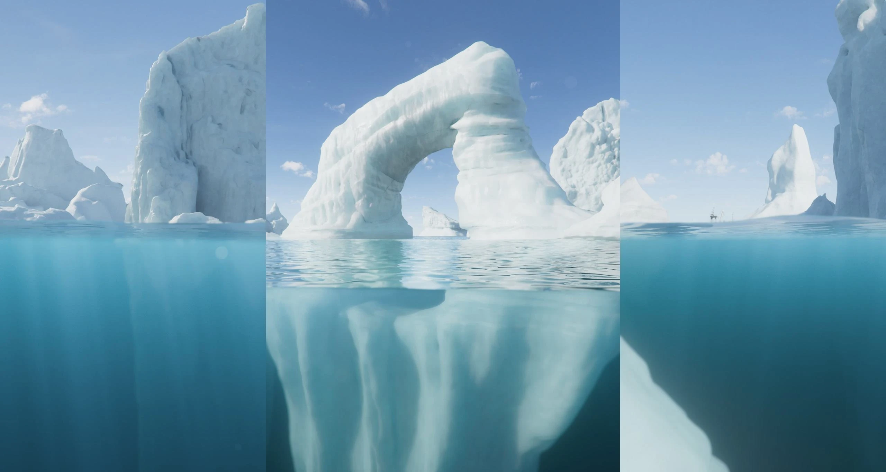
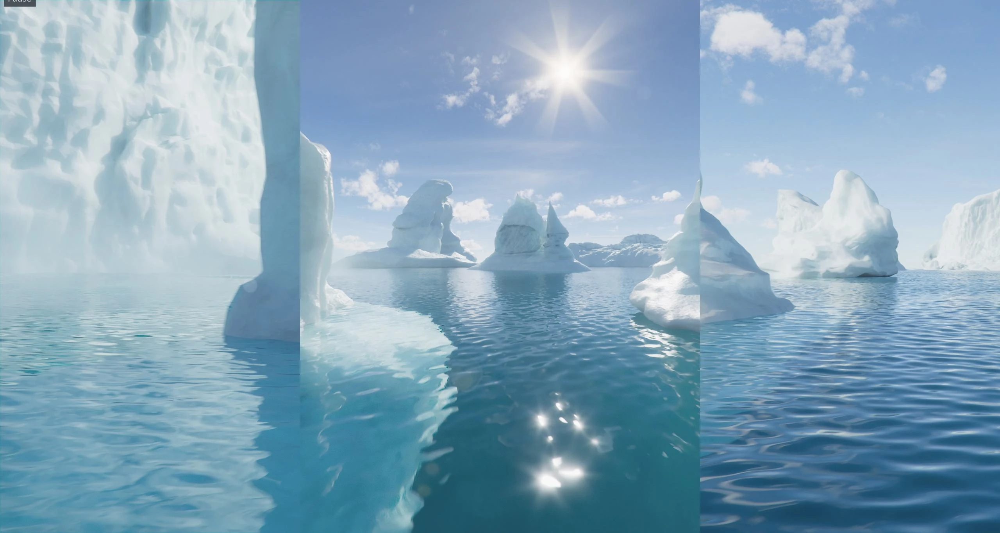
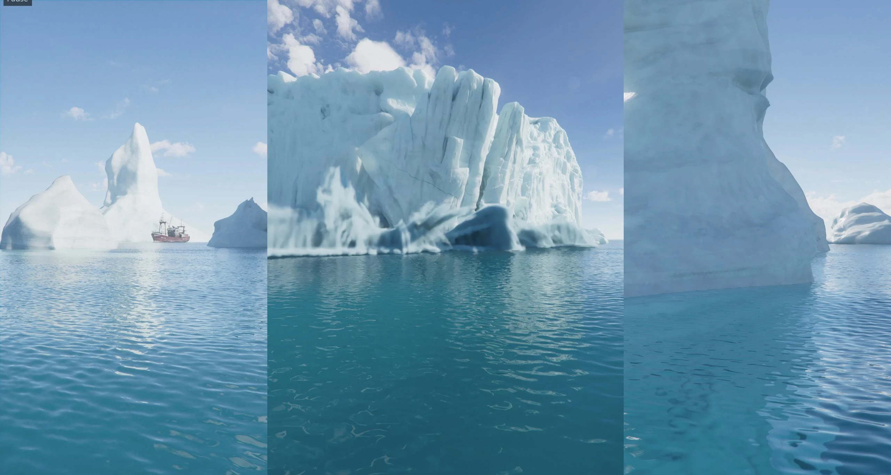
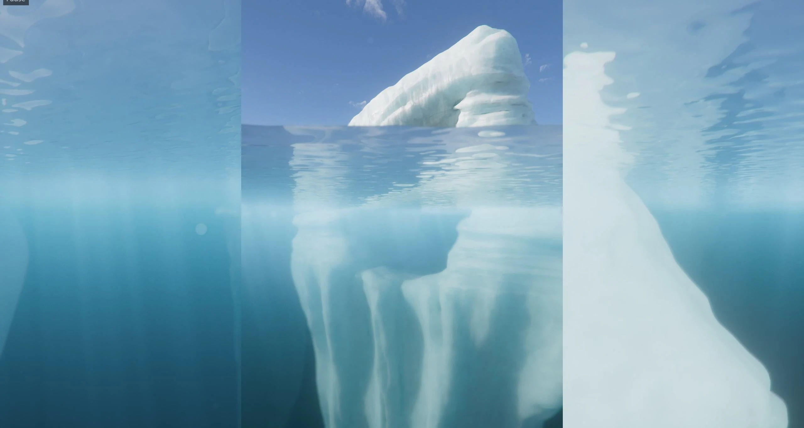
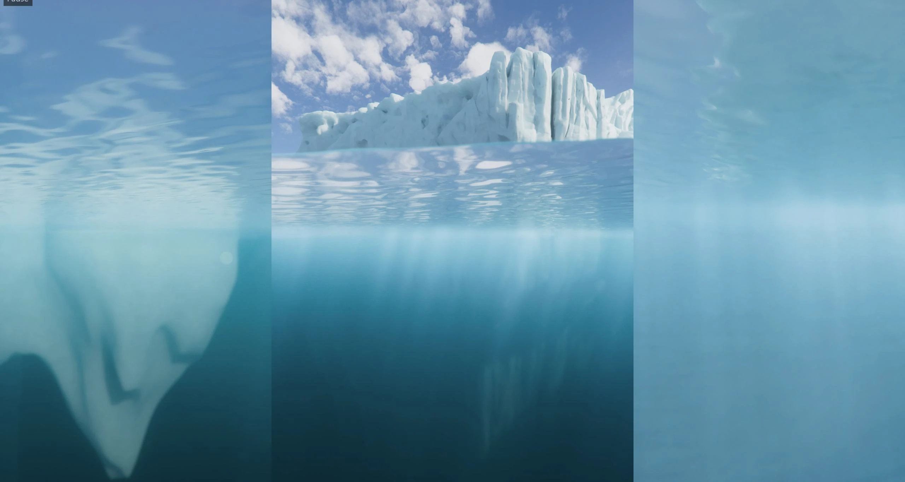

**Project Overview:** This project involved the creation of a panoramic, immersive underwater CGI film for Danfoss, specifically tailored for a 270-degree multi-projection display system across three contiguous architectural windows.

**Technical Execution:** I designed a specialized multi-camera rig to capture the wide field of view without distortion. My responsibilities included environmental layout, volumetric lighting to simulate realistic underwater depth, particle effects for marine particulates, and final rendering and compositing across all three display projection outputs.

### Danfoss Product Renders

