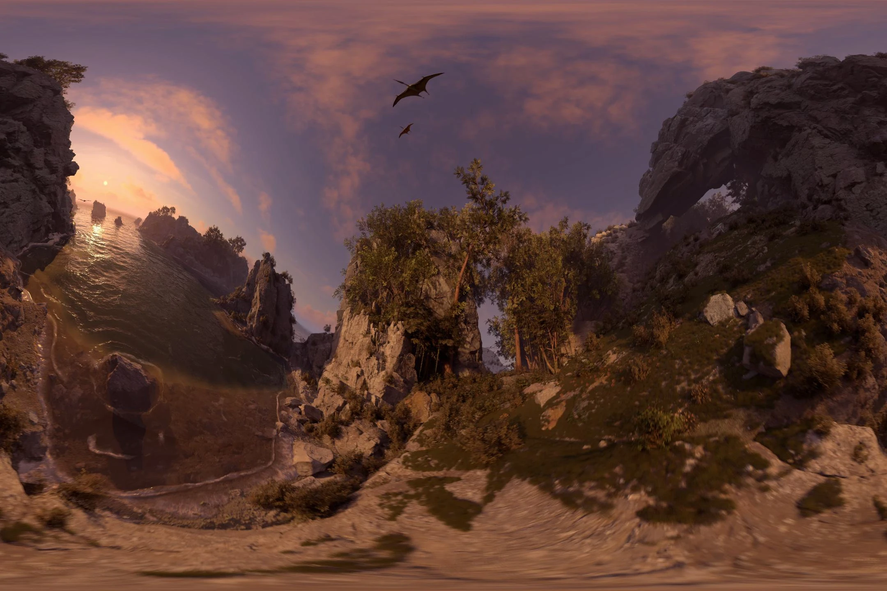
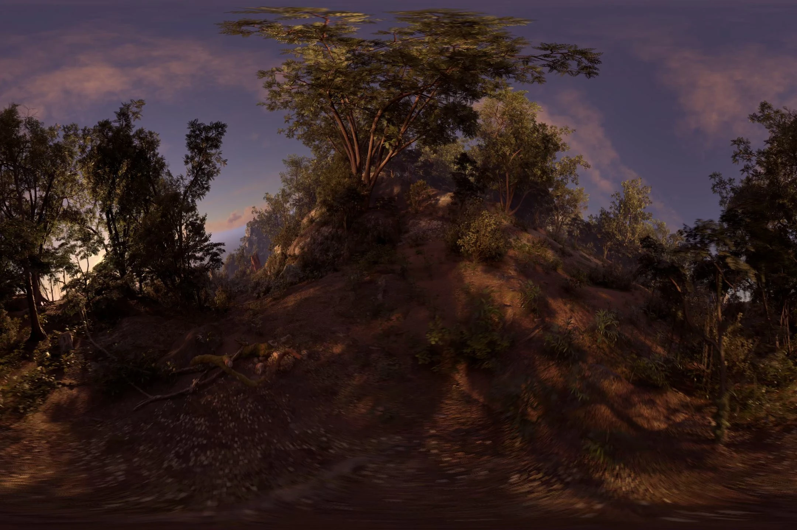
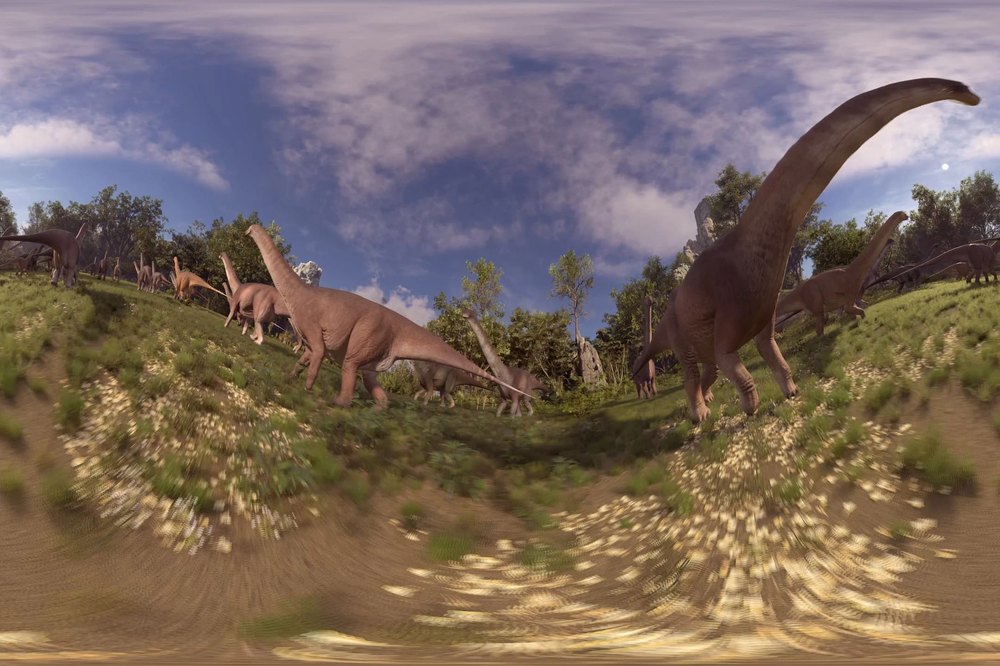
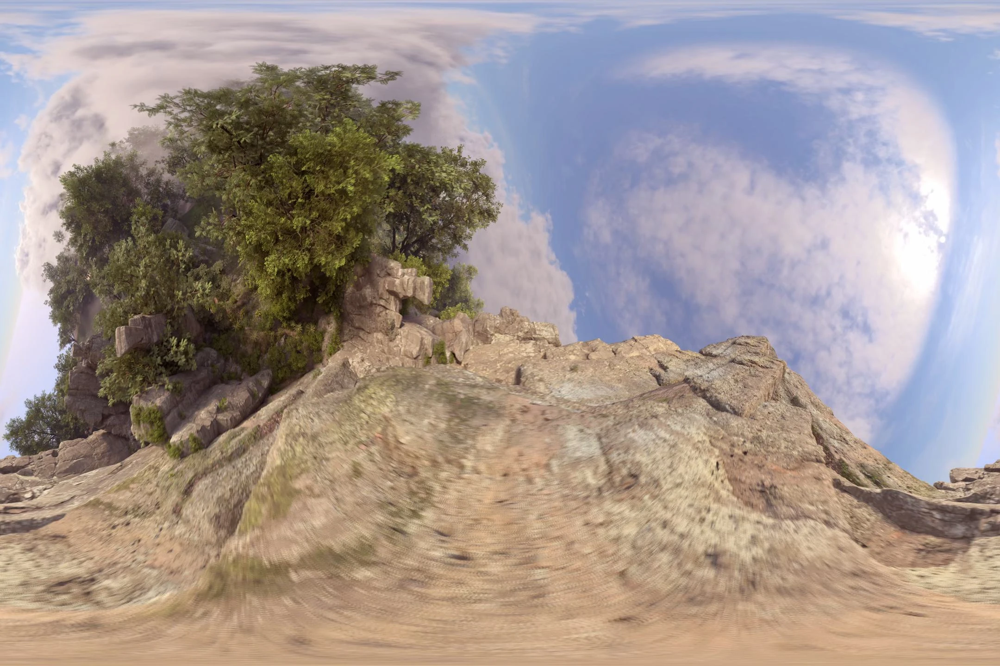
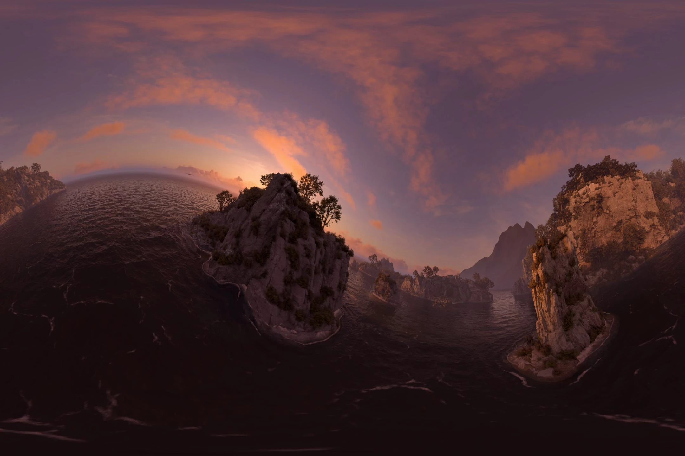
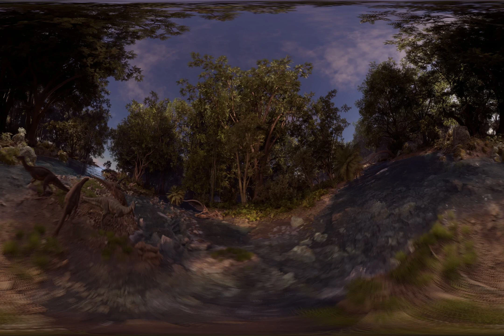
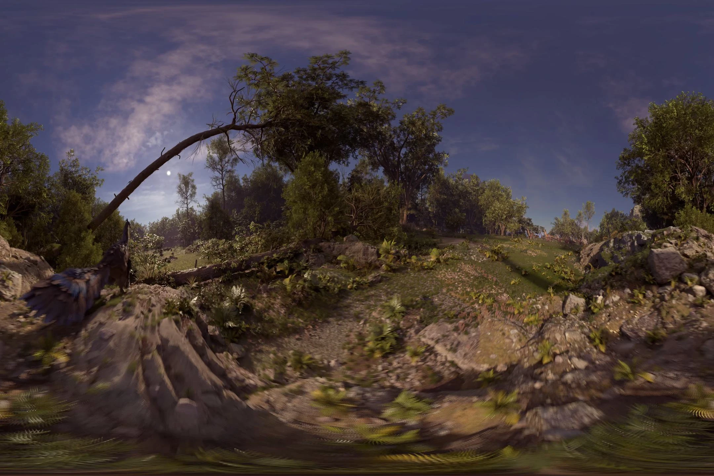
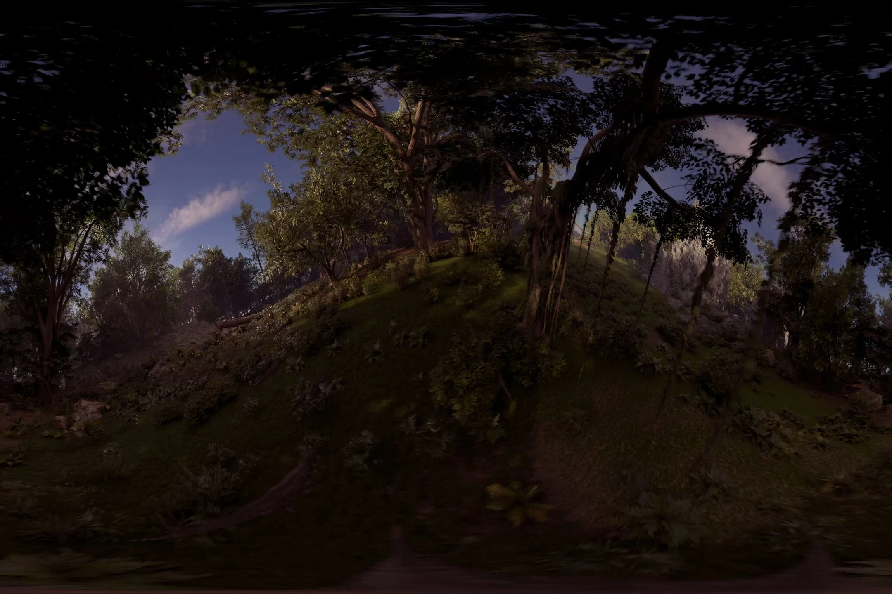
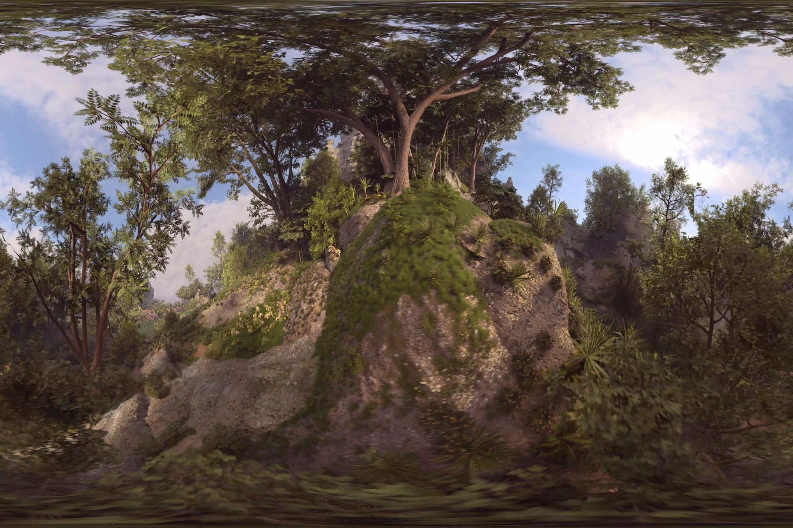

**Project Overview:** An immersive, short CGI animation developed specifically for virtual reality (VR) headsets, transporting the viewer into a detailed prehistoric environment.

**Technical Execution:** Working entirely within Unreal Engine, I developed the pipeline for rendering stereoscopic 360-degree VR content. I designed the real-time river and ocean fluid simulations, optimized materials and geometry to maintain high frame rates necessary for comfortable VR viewing, and managed the final rendering processes.

### DinoVR Experience Stills

