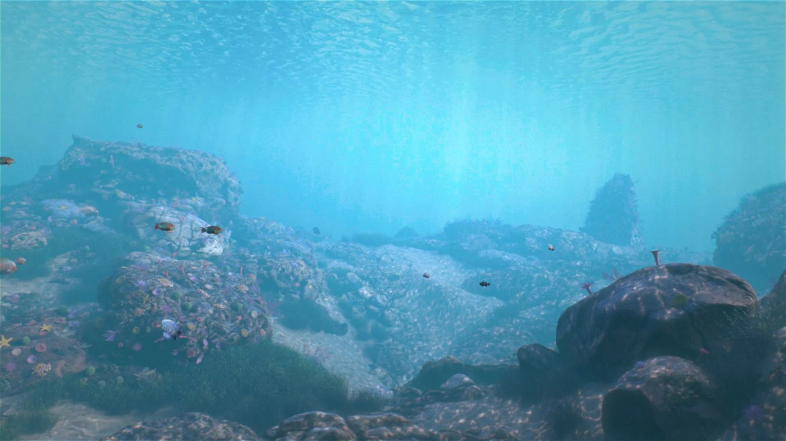
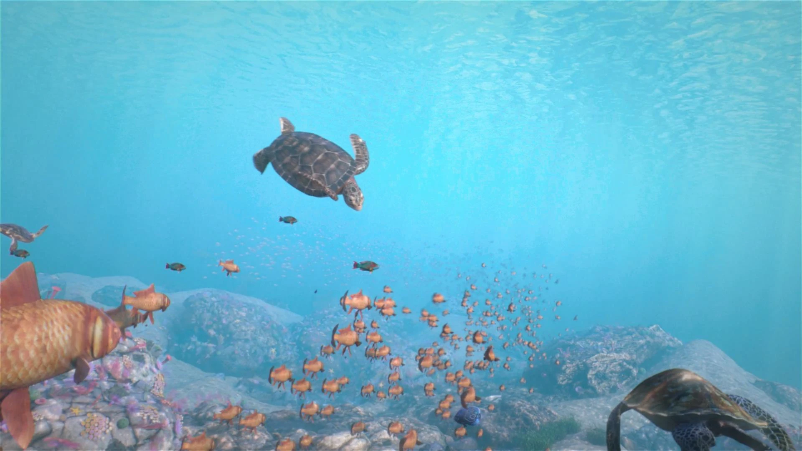
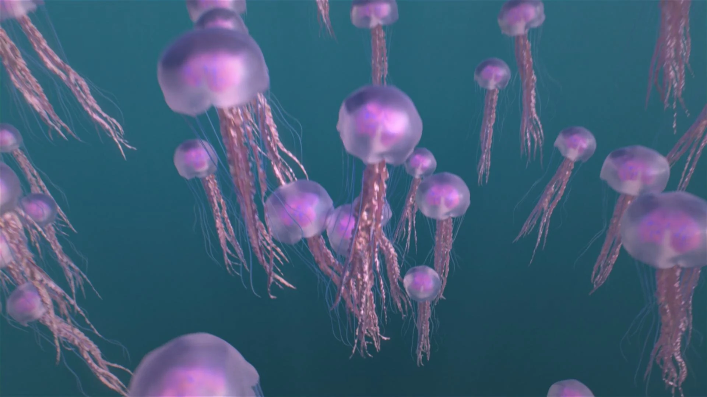
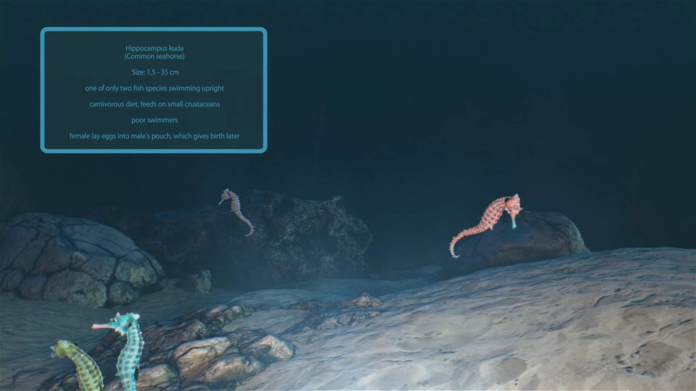
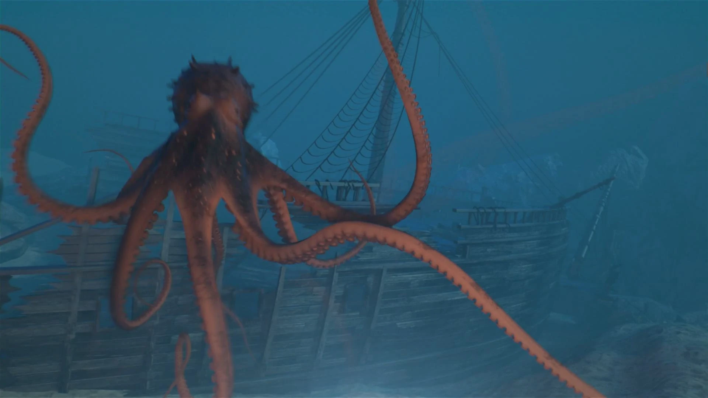
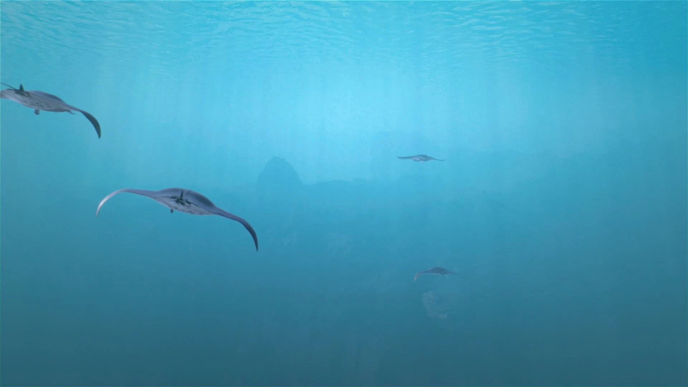
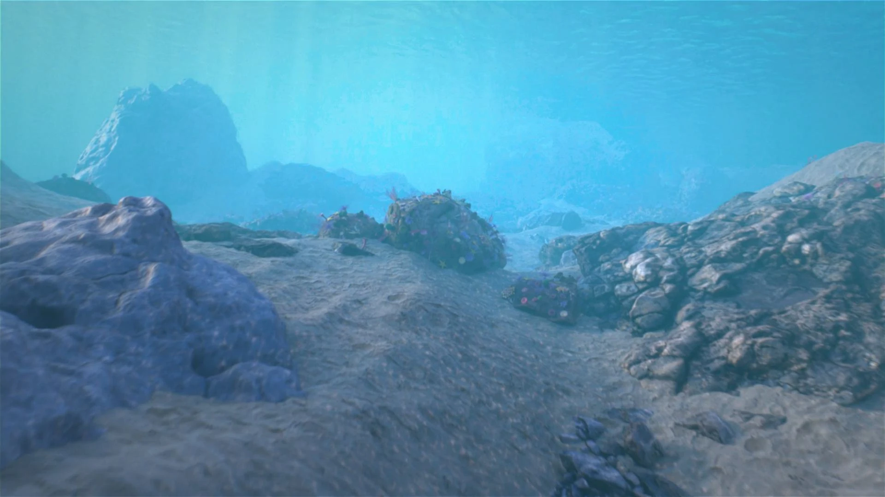

**Project Overview:** An immersive cinematic experience produced for multiple display formats, including standard 2D, stereoscopic 3D, and the unique Explorer 5D theater configuration featuring a 270-degree three-screen projection.

**Technical Execution:**
* **Immersive Deliverables:** Formatted and optimized scenes for standard 2D, stereoscopic 3D, and the Explorer 5D 270-degree projection systems.
* **Core Contribution:** Responsible for camera projection setup, environmental world-building, look development (shading/materials), and scene lighting.
* **Compositing & Optimization:** Completed final compositing passes in Nuke and implemented Arnold render optimization to ensure efficient processing.

### Dive VR Scenes

