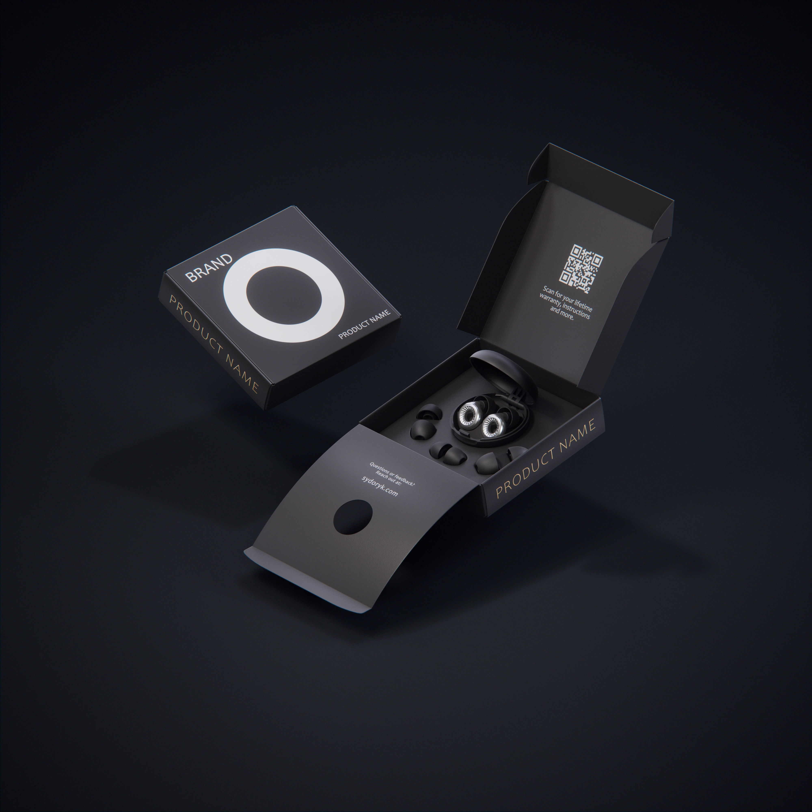

**Project Overview:** A commercial visualization featuring a custom earplug packaging design, showcasing the unfolding mechanisms and product placement.

**Technical Execution:** I modeled and rigged the packaging using Houdini to enable realistic bending and folding. I authored custom procedural materials for the paperboard and silicone textures, lit the scene, rendered the turnaround using Karma, and completed the compositing in Nuke.

### Project Media

<video width="100%" autoplay loop muted> <source src="/assets/projects/EarPlugs/EarPlugs.mp4"> </video>

<video width="100%" autoplay loop muted> <source src="/assets/projects/EarPlugs/EarPlugs_quickSpin_1080p.mp4" type="video/mp4"> </video>

### Earplug Renderings

