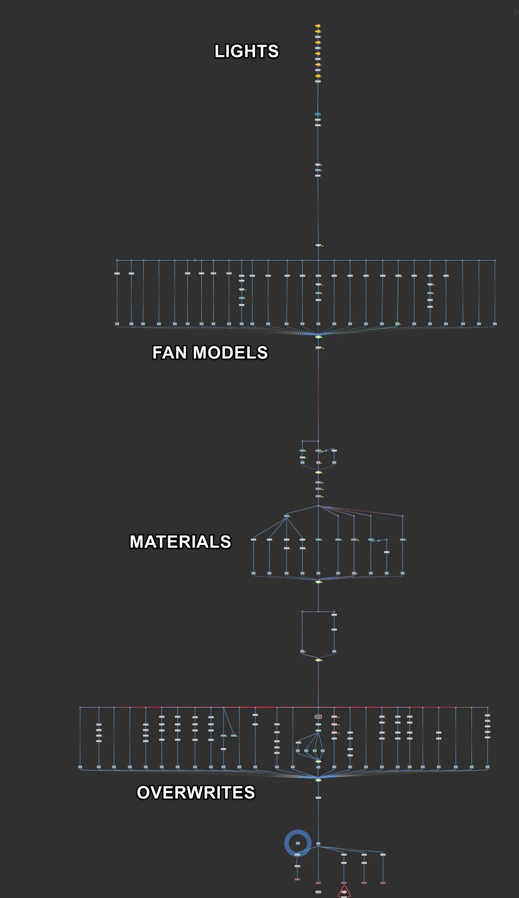
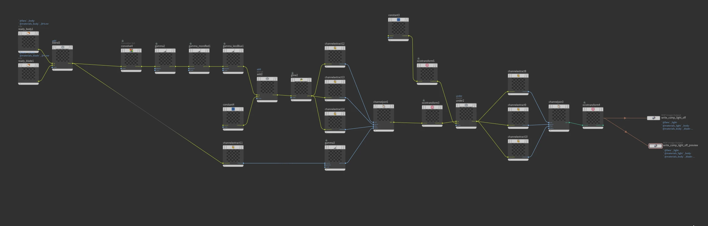
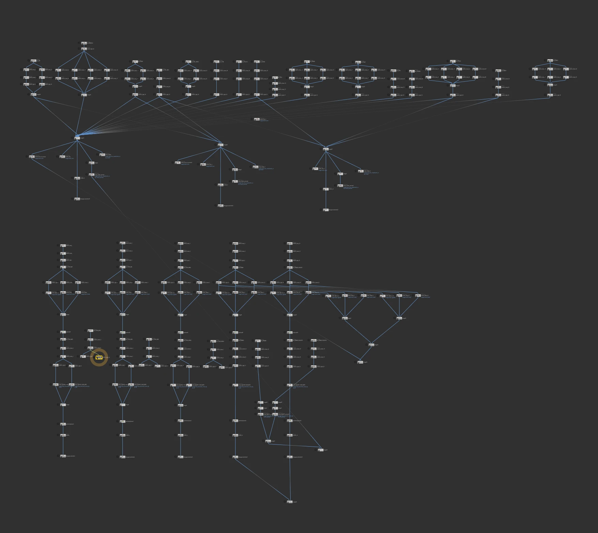

**Project Overview:** The client required a suite of high-resolution product turnaround videos for their industrial and domestic fan catalogs, showcasing multiple product variations.

**Technical Execution:** Each fan model required up to 24 color, material, and light state permutations. I ingested low-quality raw CAD data and rebuilt it into clean, high-resolution meshes using VDB remeshing and retopology workflows. Leveraging Houdini Solaris (USD), I designed a modular look development and variant assembly system. I automated the camera positioning, lighting setups, render layer outputs, compositing (COPs), and video compression (FFmpeg) using Houdini TOPs, achieving a fully automated batch processing pipeline.

### Project Media

<video width="100%" autoplay loop muted> <source src="/assets/projects/Fans/fans_collage_1500p.mp4"> </video>

<video width="100%" autoplay loop muted> <source src="/assets/projects/Fans/fans_example.mp4" type="video/mp4"> </video>

### Houdini VOP Scene Setup

### Houdini COP Compositing

### Houdini TOP Automation

