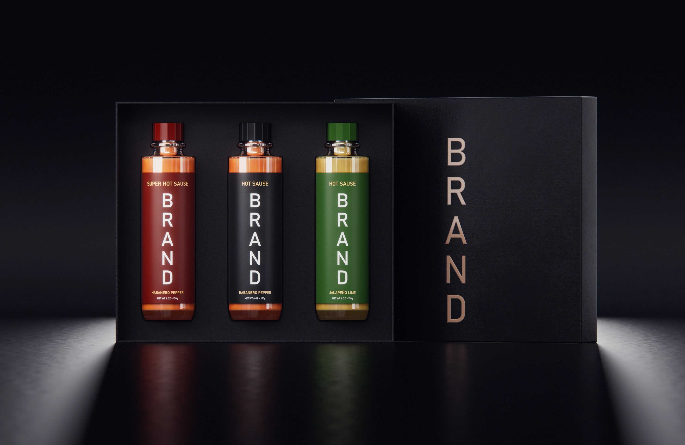
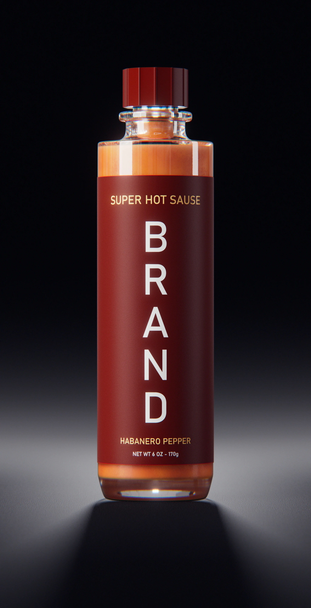
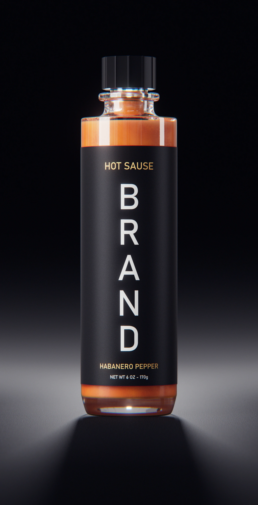
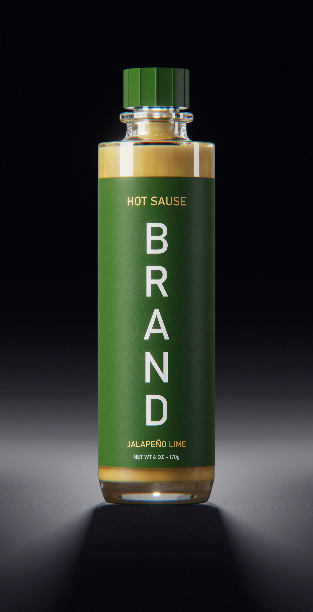

### Project Overview
A high-end commercial look development and packaging design concept for a premium hot sauce brand, featuring realistic liquid and glass interaction.

### Technical Execution
I constructed the packaging and bottle geometry inside Houdini. I developed custom shaders to accurately capture the glass refraction, label texture details, and liquid viscosity. Final renders were composited in Nuke to fine-tune color accuracy, specular highlights, and reflections.

<video width="100%" autoplay loop muted> <source src="/assets/projects/HotSause/hot_sause.mp4"> </video>

