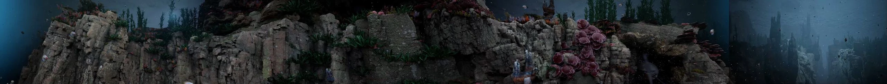
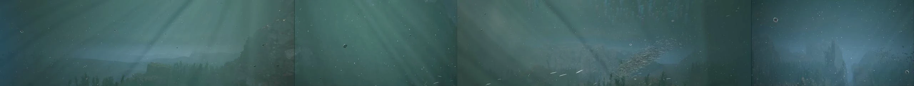
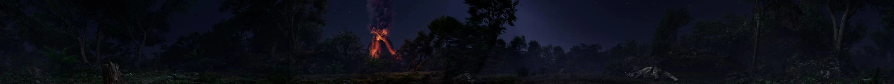
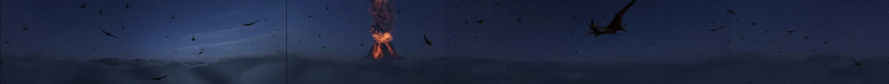
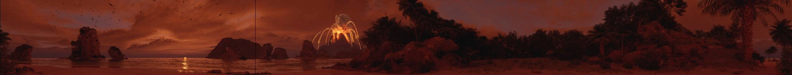
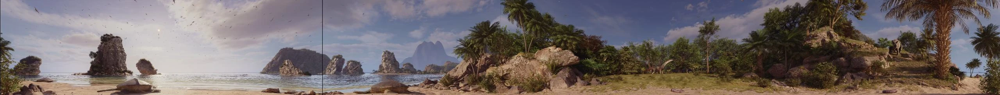
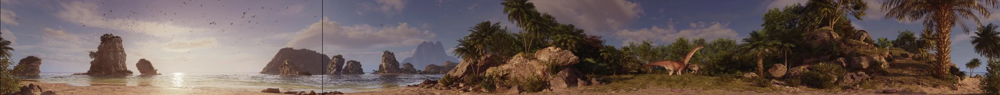
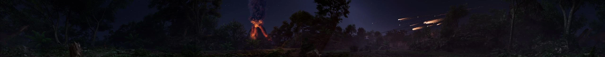
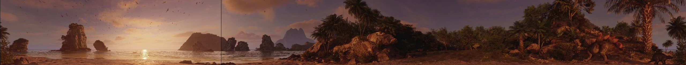

### Project Overview
A premium cinematic CGI film created for the IMMERSIUM Jurassic experience, utilizing an immersive multi-projection display comprising four perimeter walls (360-degree horizontal field of view) and a synchronized floor projection.

### Technical Execution
* **Projection R&D:** Researched and developed a custom multi-camera layout to align visual output with the 5-wall projection mapping format.
* **Creative pipeline:** Spearheaded look development, environmental shading, final rendering, and panoramic compositing in Nuke across the entire display canvas.

### Immersium VR Scenes

