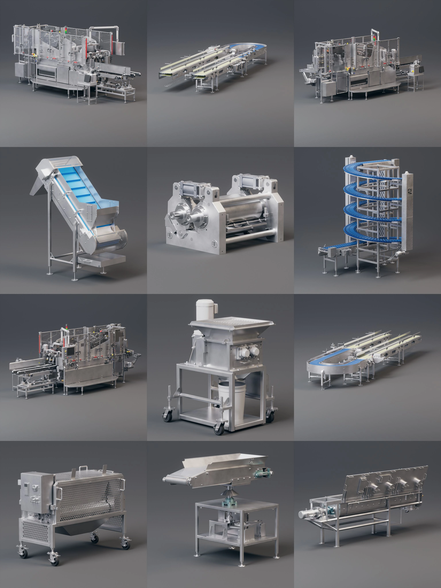
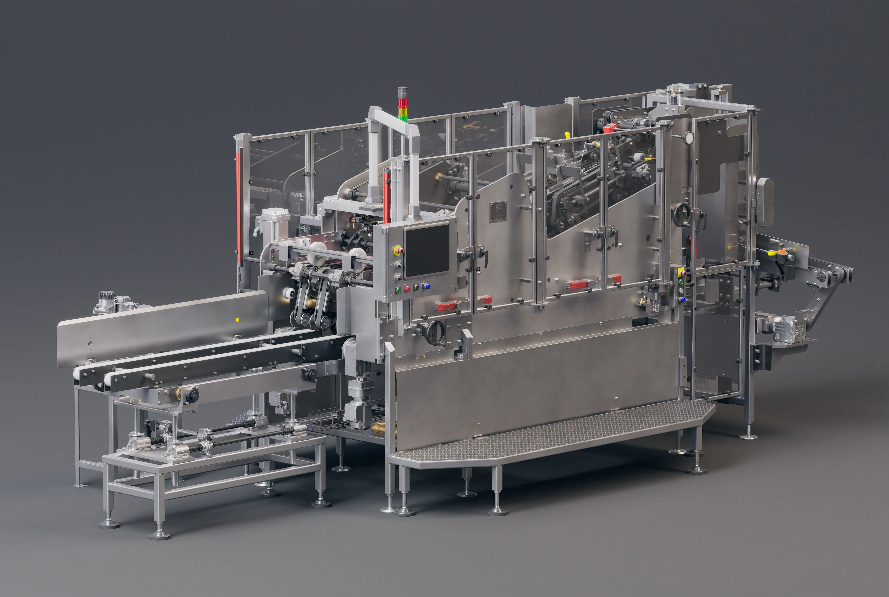
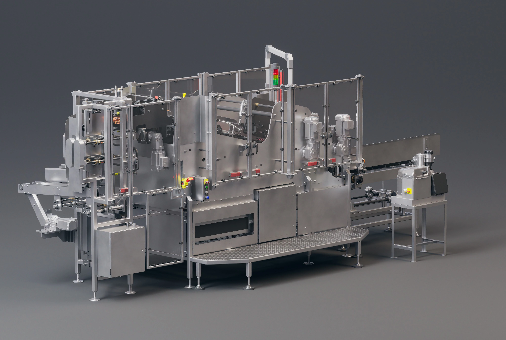
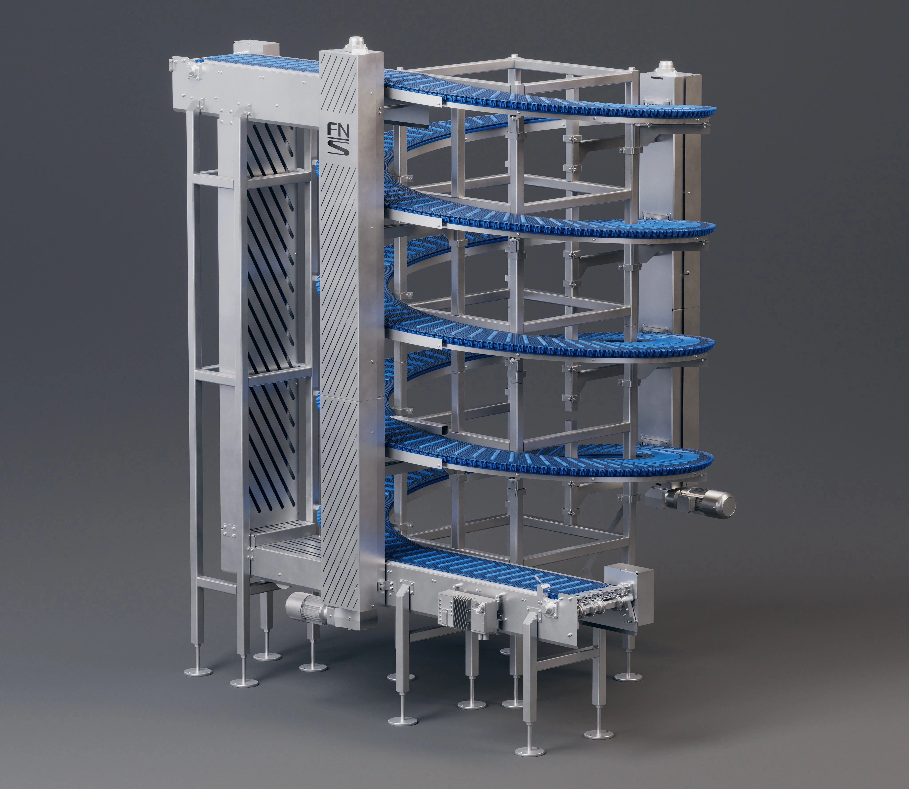
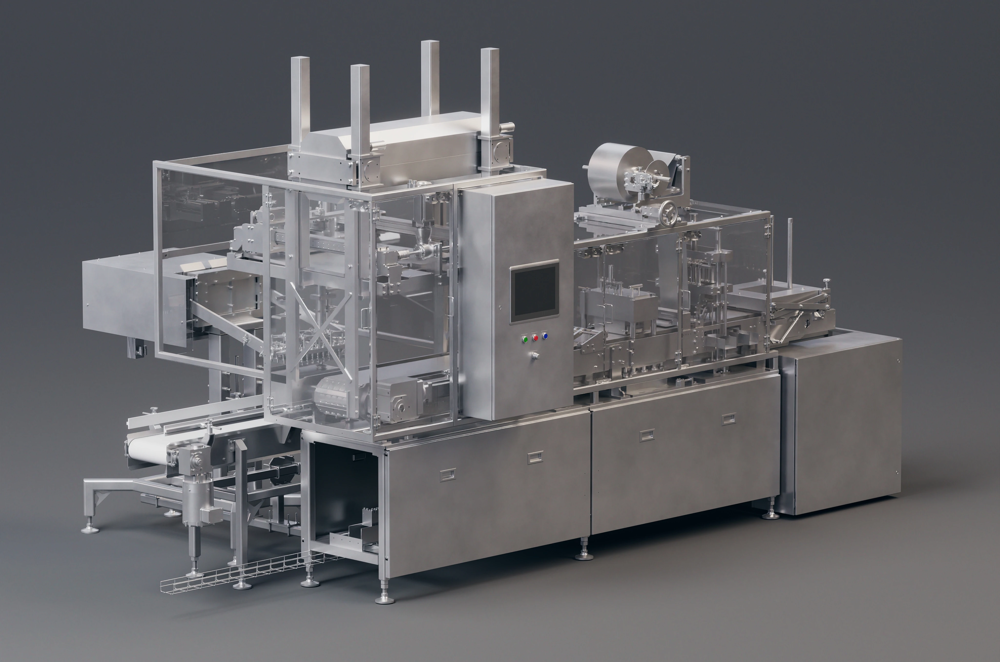
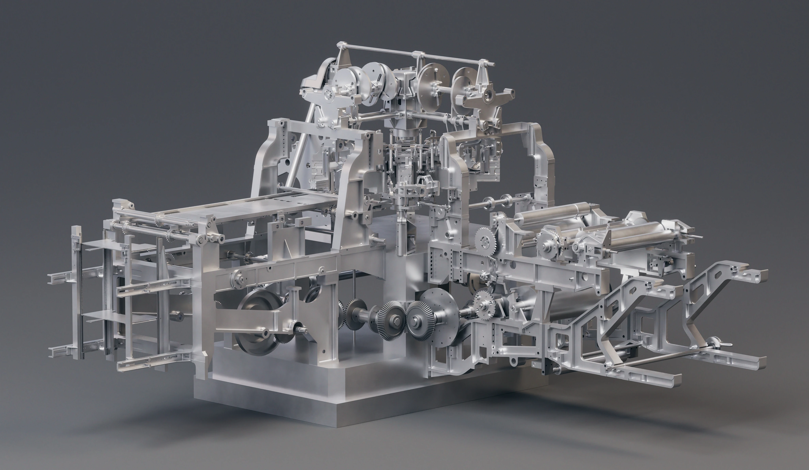
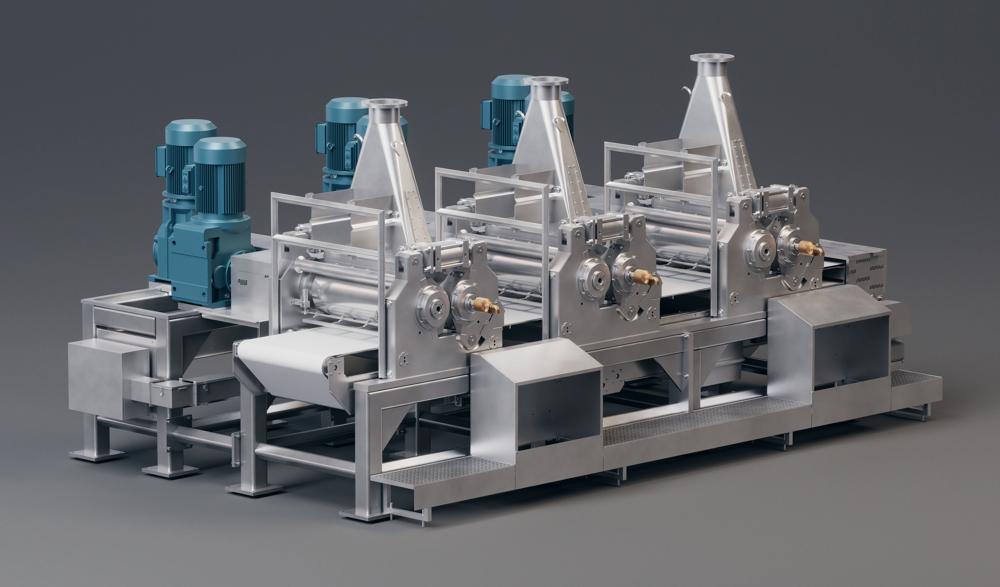
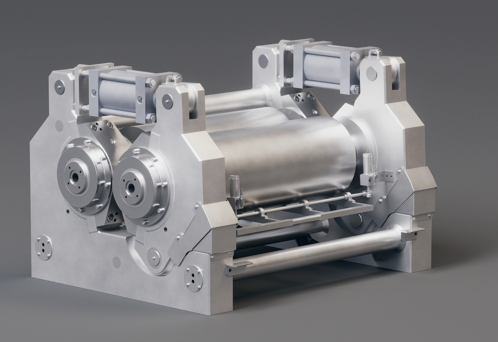

**Project Overview:** A US-based manufacturing client, F.N. Smith, required production-ready marketing visualizations of their industrial food processing equipment line, developed from raw CAD files.

**Technical Execution:**
* **Geometry Processing:** Transformed highly detailed engineering STEP files into clean, optimized polygonal geometry using Moi3D and Houdini.
* **Asset Modeling:** Modeled missing secondary components (e.g., modular conveyor belts, hardware) from reference layouts.
* **Lookdev & Lighting:** Developed physically accurate PBR textures, set up a custom studio camera rig, and established a unified lighting style to ensure visual consistency across all assets.
* **Flexible Deliverables:** Provided renders in three layouts—transparent background, studio background, and wireframe blueprint style.

### Project Media

<video width="100%" autoplay loop muted> <source src="/assets/projects/IndustrialEquipment/IndustrialEquipment_wireframe.mp4" type="video/mp4"> </video>

### System Collage

### Individual Machine Visualizations

### Equipment Renderings

