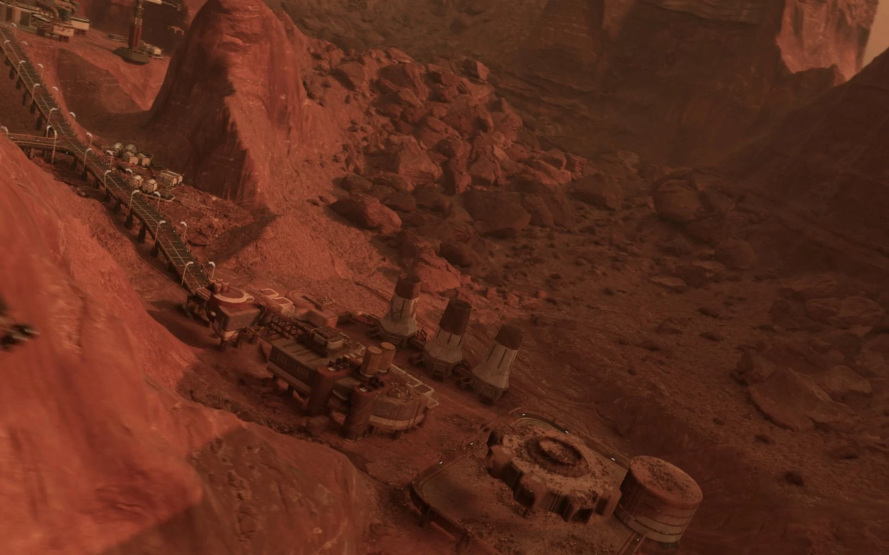
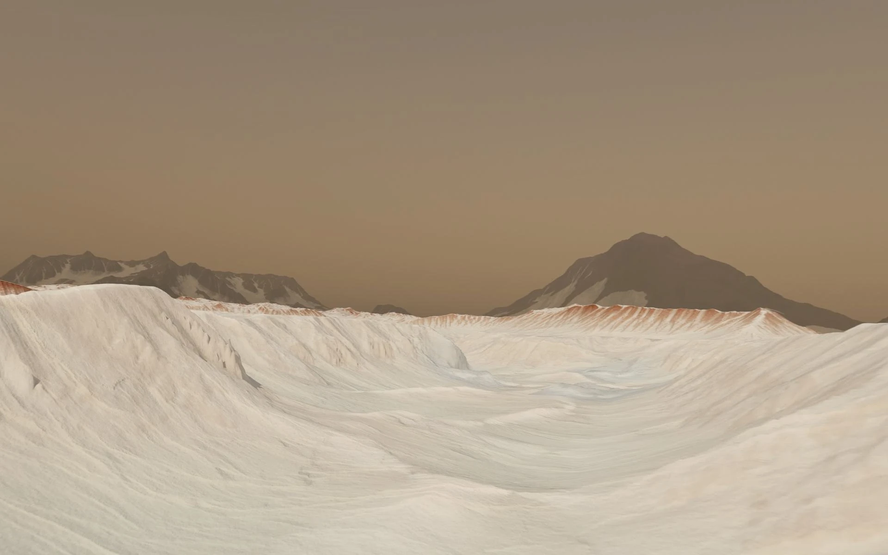
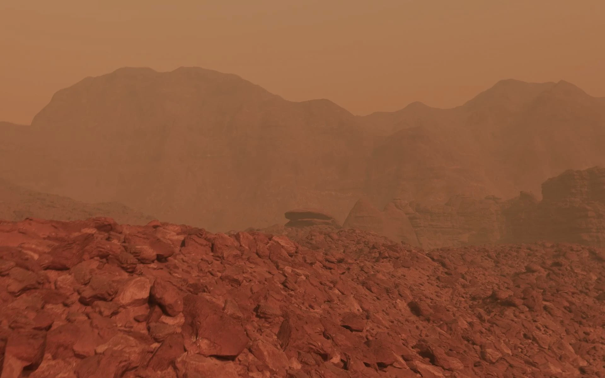
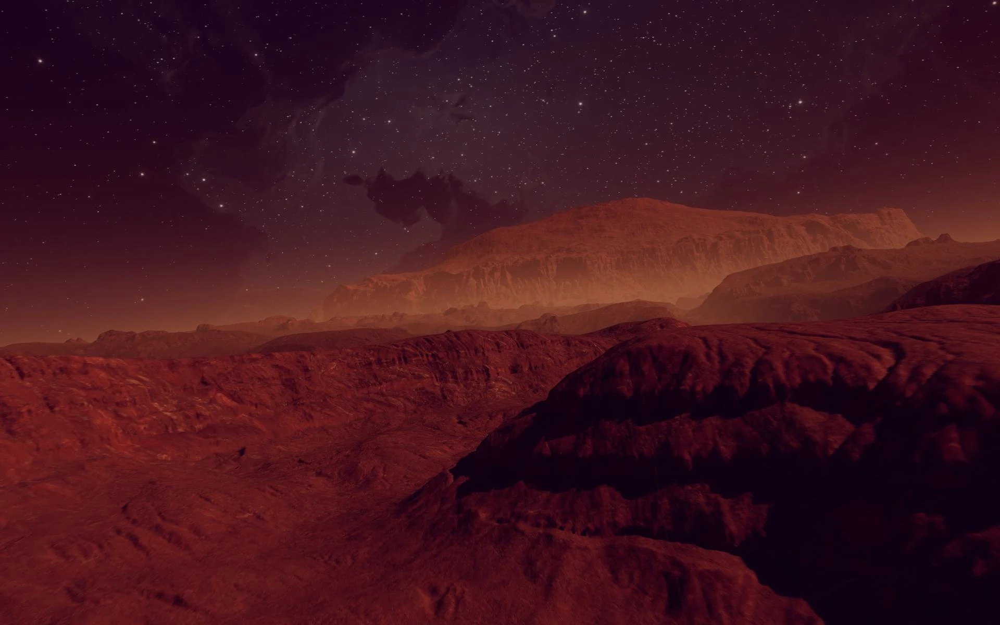
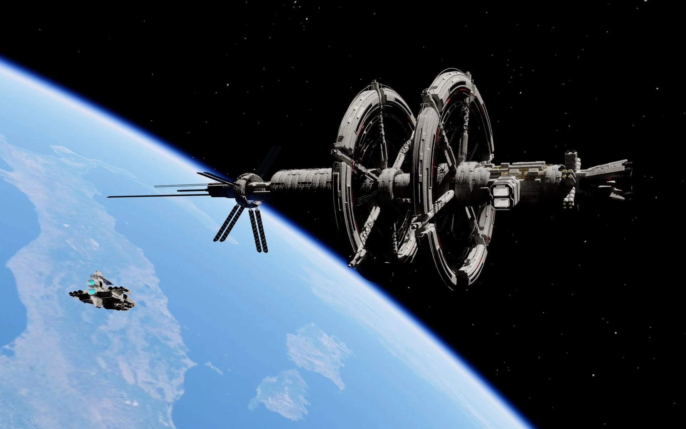
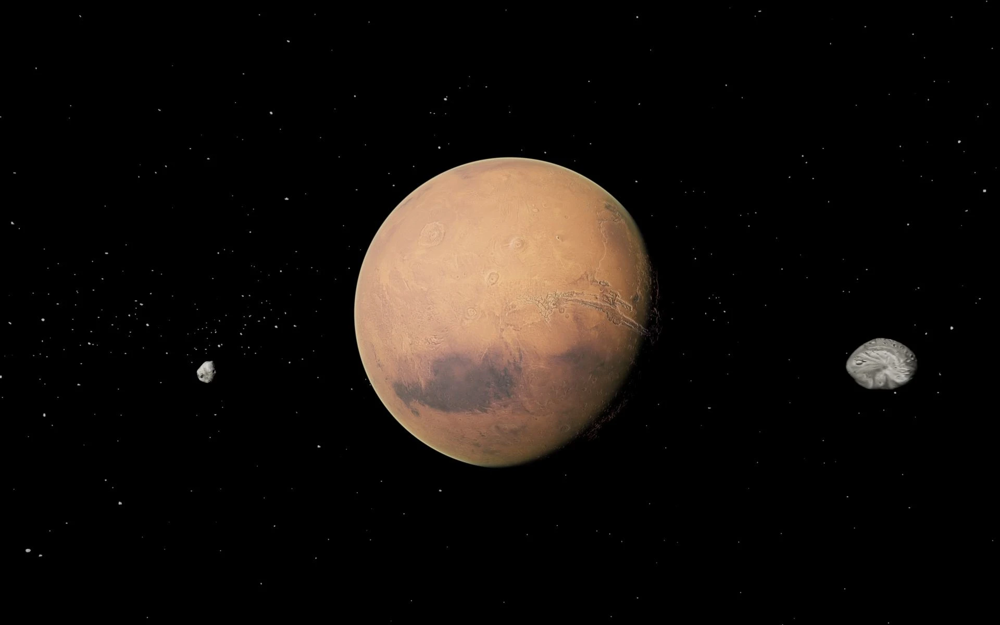

**Project Overview:** A cinematic science education film showcasing key landing sites, geological formations, and points of interest on Mars, optimized for multiple display outputs—standard 2D, stereoscopic 3D, and the 270-degree Explorer 5D platform.

**Technical Execution:**
* **Landscape Generation:** Modeled the Martian surface terrains in Houdini using heightfields and volumetric noise.
* **Procedural Scattering:** Developed custom procedural content generation (PCG) systems to scatter rocks and debris dynamically.
* **Lookdev & Render:** Created realistic solar lighting, atmospheric dust scattering effects, and managed rendering and compositing pipelines.

### Mars Environment Visuals

