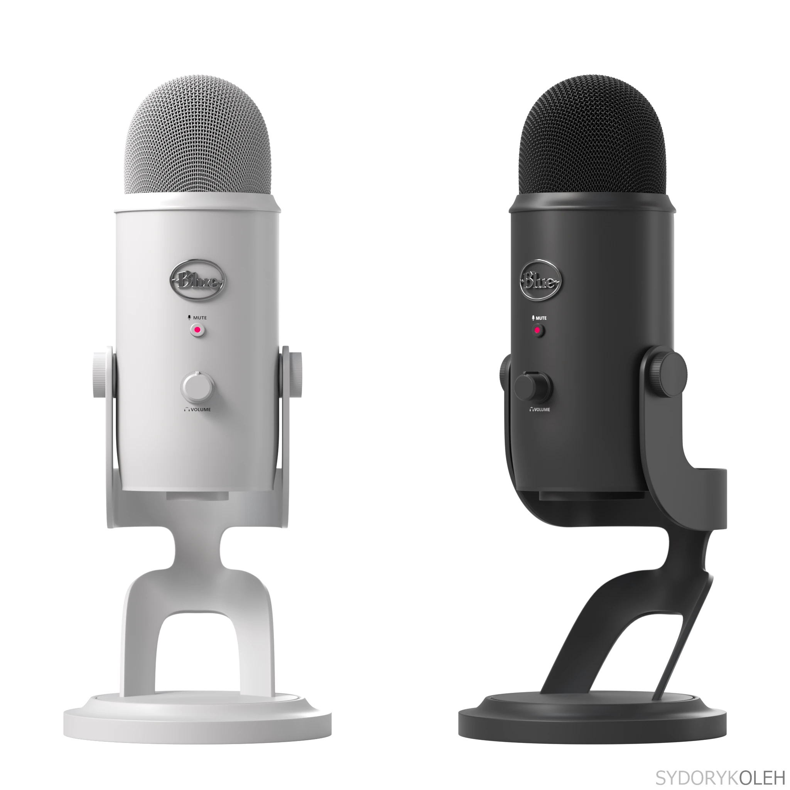
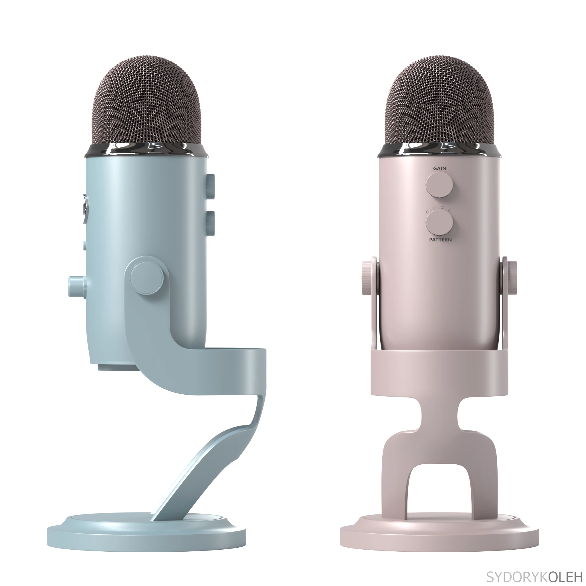
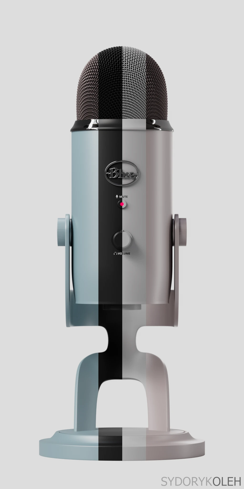

**Project Overview:** A premium product visualization showcasing a detailed 3D microphone model, featuring a stylized cloth-peel reveal animation.

**Technical Execution:** I modeled the microphone with high geometric precision inside Houdini. Using Houdini's Vellum solver, I created a realistic cloth simulation that slides off the microphone structure. I handled all shading, studio-style lighting, rendering via Mantra/Karma, and composited the final passes in Nuke to bring out micro-scratches and metallic reflections.

### Project Media

<video width="100%" autoplay loop muted> <source src="/assets/projects/Microphone/microphone_with_cloth.mp4"> </video>

### Microphone Renders

