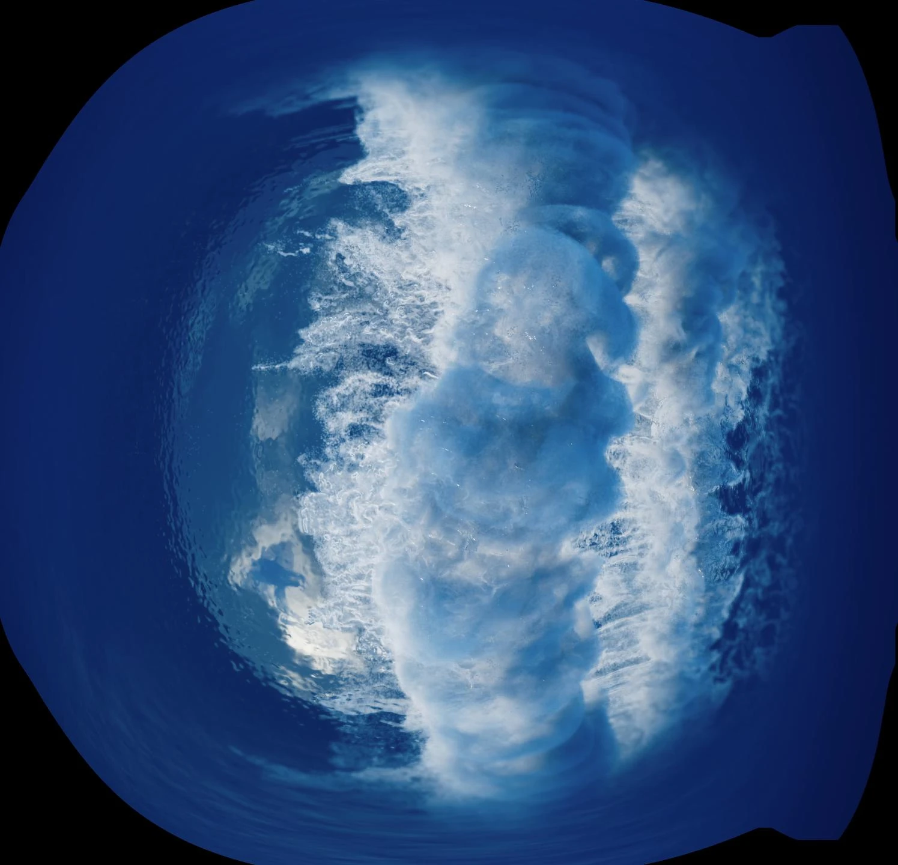
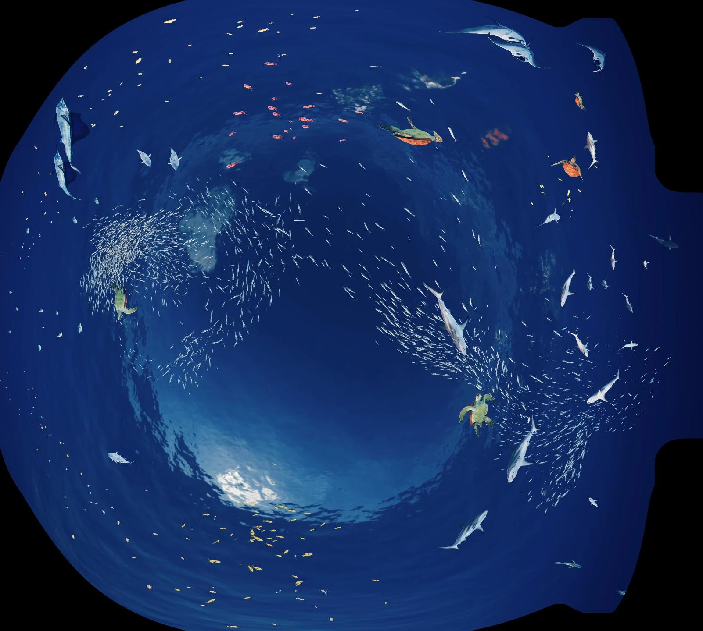
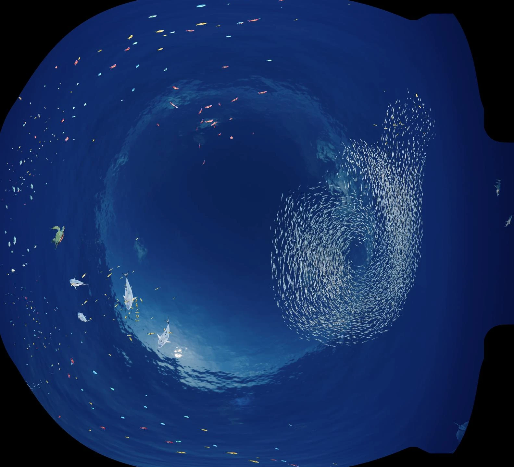
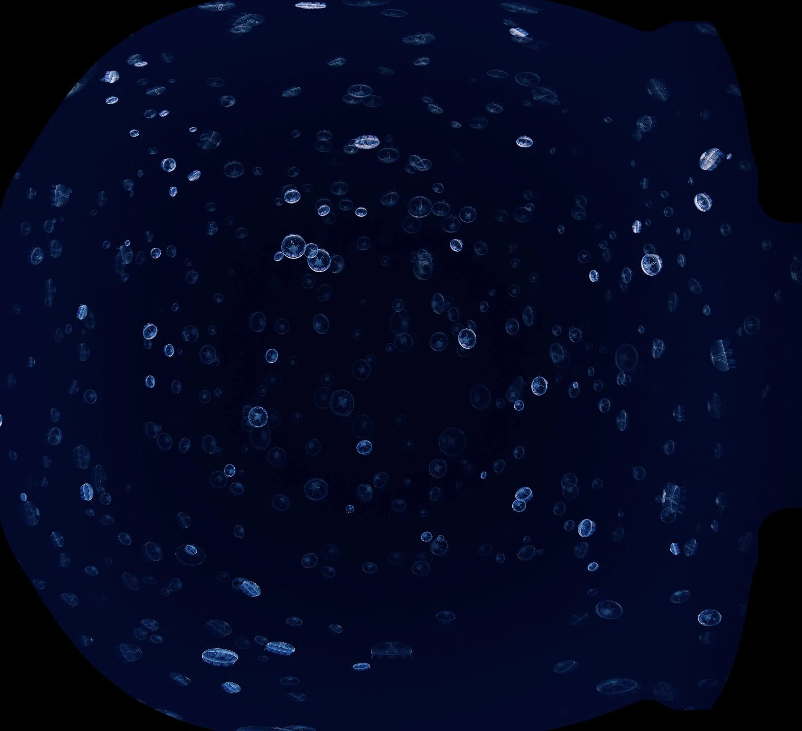
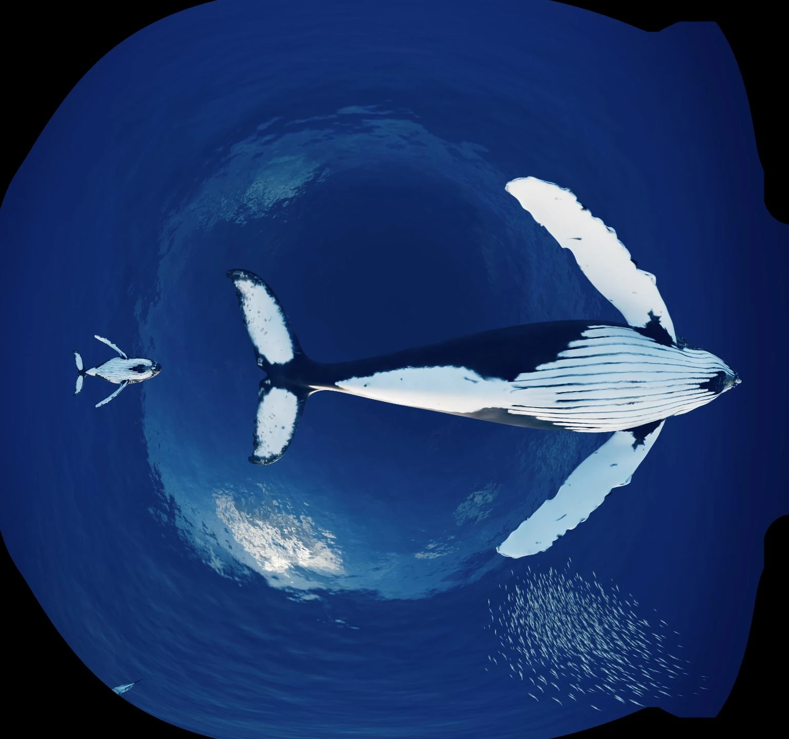
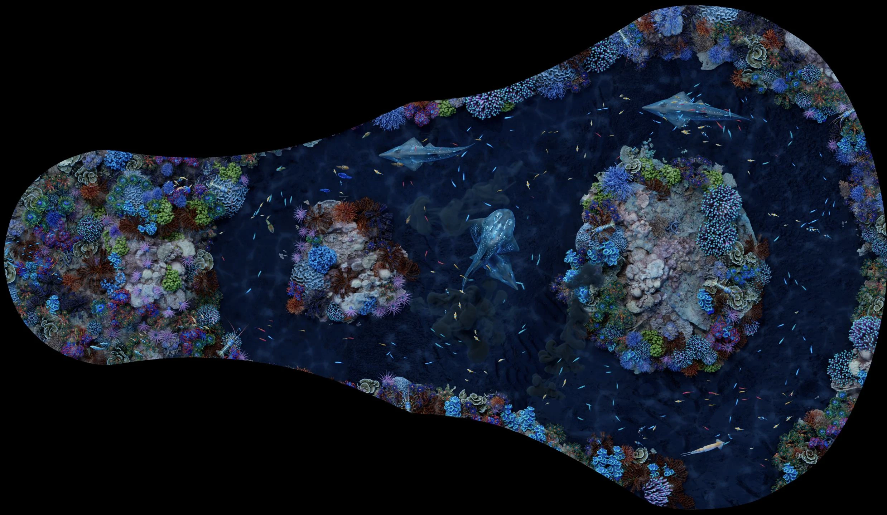
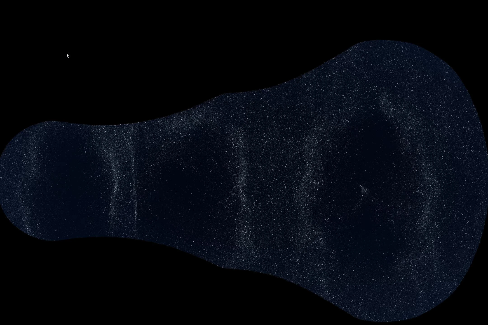

**Project Overview:** A highly immersive CGI movie produced for the massive curved projection system at the Coral Kingdom, located in Loro Parque, Tenerife. The final deliverables required an ultra-high resolution output of 18K to ensure crystal-clear visual quality across the entire dome screen.

**Technical Execution:**
* **Curved Projection R&D:** Designed and calibrated a custom multi-camera setup to project imagery accurately on curved surfaces without distorting geometry.
* **FX Integration:** Integrated heavy fluid and water simulations within Unreal Engine and Redshift.
* **Atmospherics & Simulation:** Crafted realistic smoke and atmospheric FX using EmberGen and custom particle systems in Unreal.
* **Lookdev & Comp:** Led the shading, lighting direction, and multi-pass compositing in Nuke.

### NaturaVision Scenes

