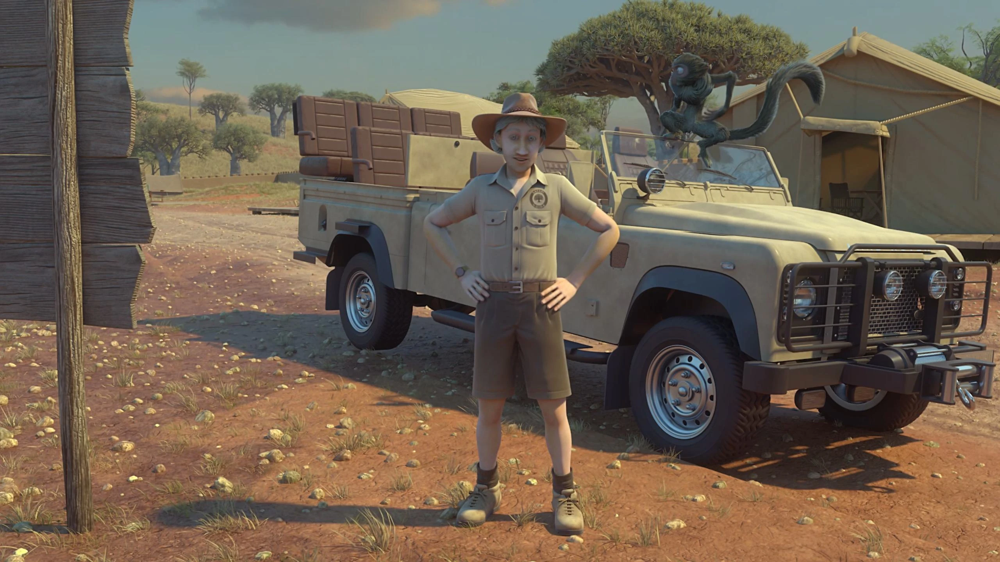
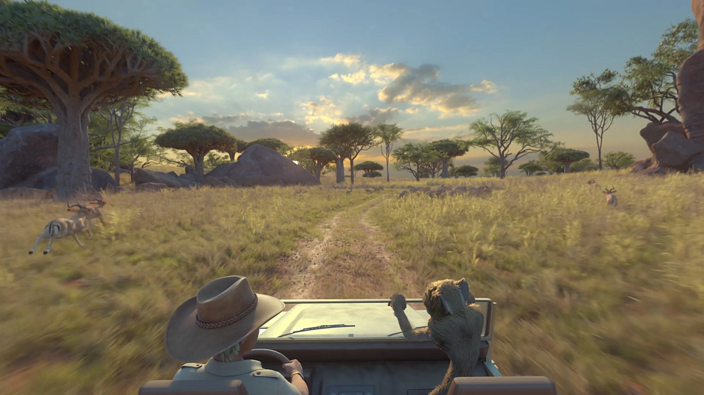
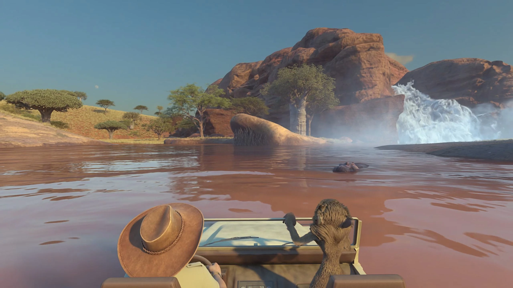
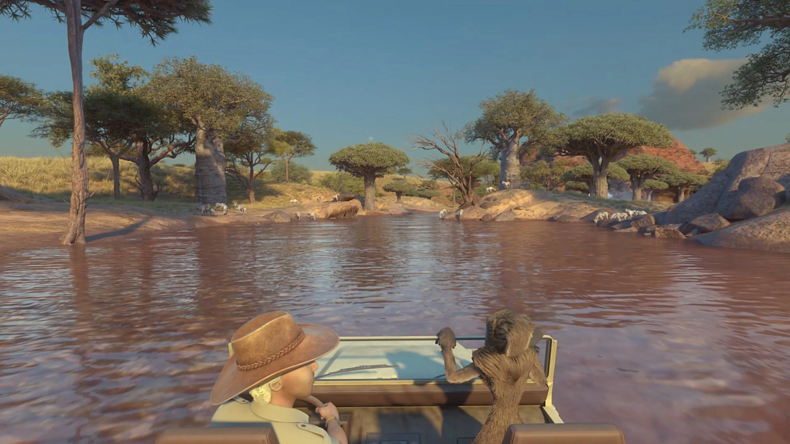
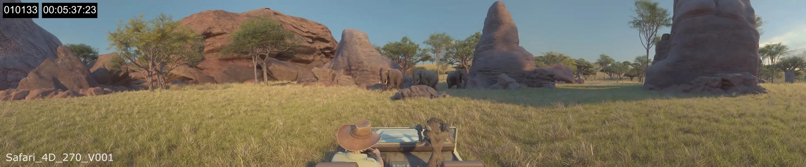
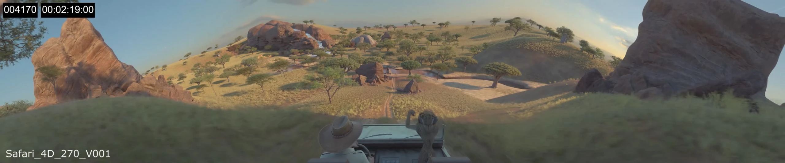
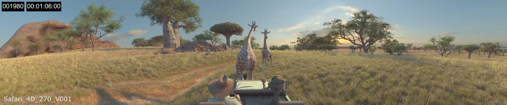
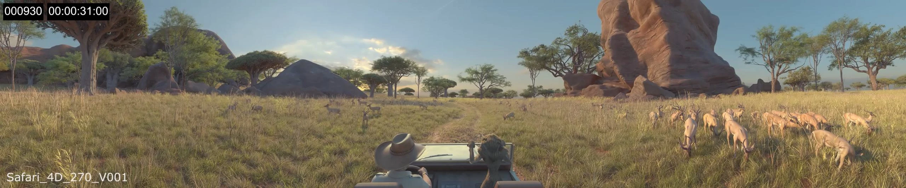

**Project Overview:** A dynamic, action-packed CGI ride film simulating a high-speed jeep journey through a wild safari environment. The production was formatted for multiple theater systems, including standard 2D, stereoscopic 3D, and three-screen 270-degree Explorer 5D theaters.

**Technical Execution:** My role encompassed environmental layout design, terrain generation, and procedural foliage placement. I set up camera projection pipelines, established the art direction's visual tone through custom shading and lighting, and composited the final sequences in Nuke. I also optimized render settings to maintain quick turnaround times for Arnold.

### Safari VR Scenes

