### Project Overview
A 7-minute immersive CGI animated film produced for the Cinesplash 5D theater at Sonnentherme Lutzmannsburg. The movie tracks the whimsical journeys of three young friends - Sunny Bunny, Pinky Bunny, and Mattie - as they are transported into magical storybook worlds.

### Technical Execution
* **Lighting & Shading R&D:** Researched and established real-time rendering pipelines inside Unreal Engine, customized for 270-degree multi-projection.
* **Shot Production:** Directed lighting and composited over 50 cinematic shots.
* **FX & Tech:** Developed custom stylized toon-shaders, master materials, and procedural particle transitions between scene environments.

### FX Examples

<video width="100%" autoplay loop muted> <source src="/assets/projects/SunnyBunny/Bunny_particles_720p_web.mp4"> </video>

<video width="100%" autoplay loop muted> <source src="/assets/projects/SunnyBunny/Bunny_transition1_720p_web.mp4"> </video>

<video width="100%" autoplay loop muted> <source src="/assets/projects/SunnyBunny/Bunny_transition2_720p_web.mp4"> </video>

<video width="100%" autoplay loop muted> <source src="/assets/projects/SunnyBunny/Bunny_transition3_720p_web.mp4"> </video>

### Movie Stills

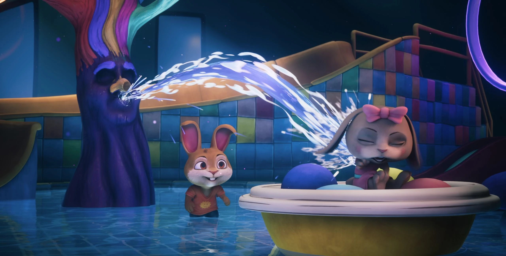
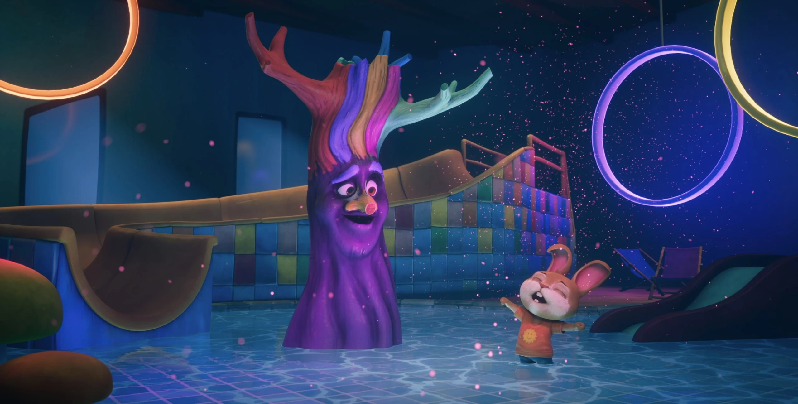
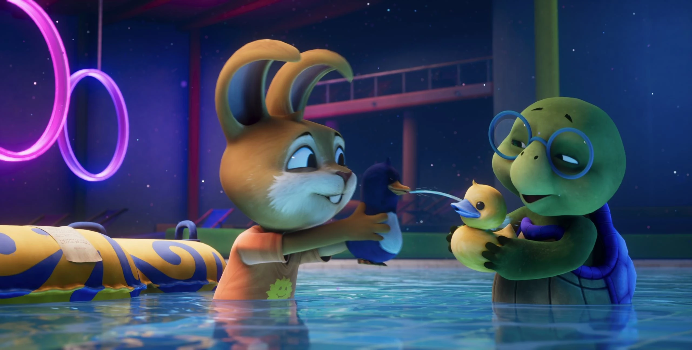

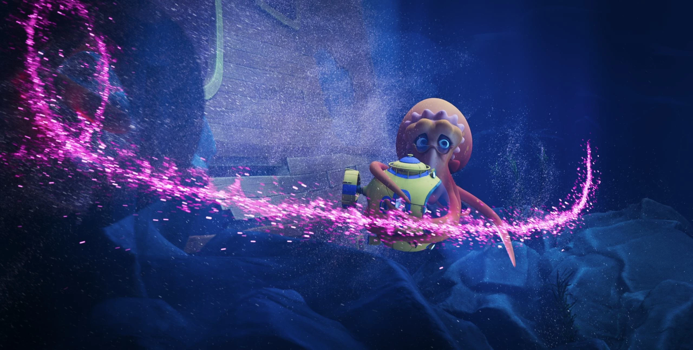
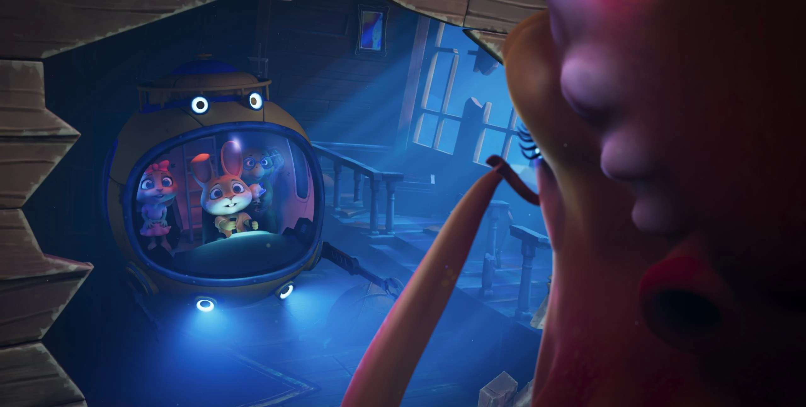
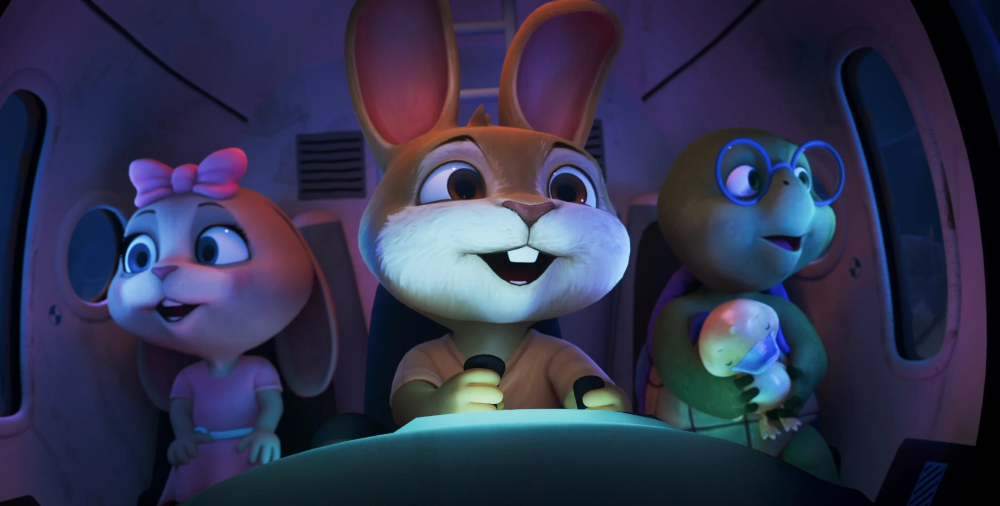
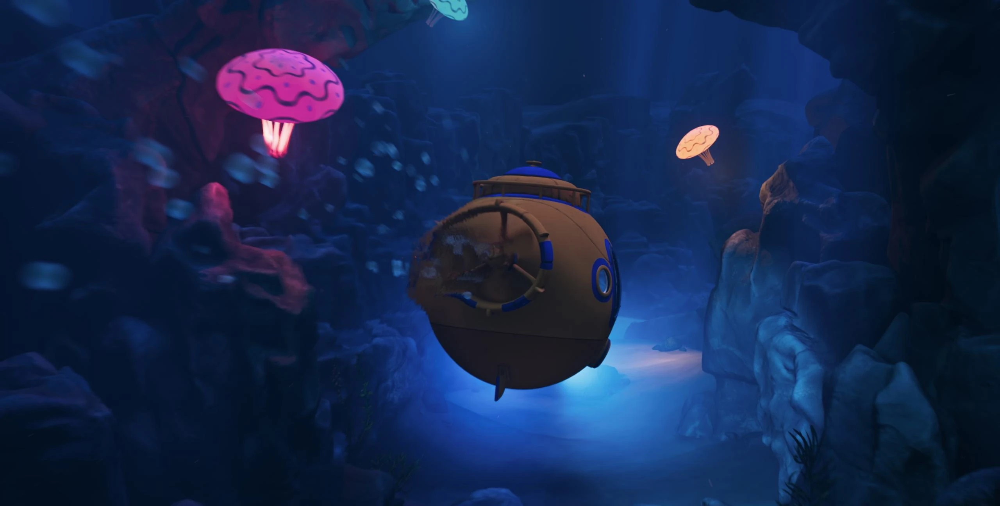
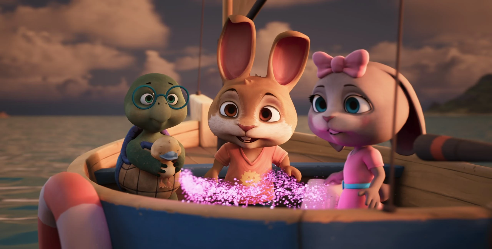
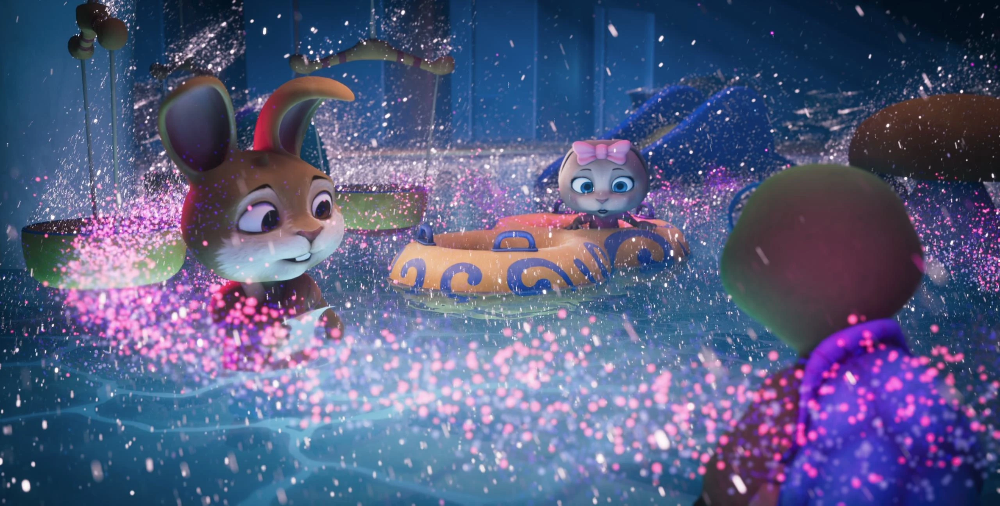
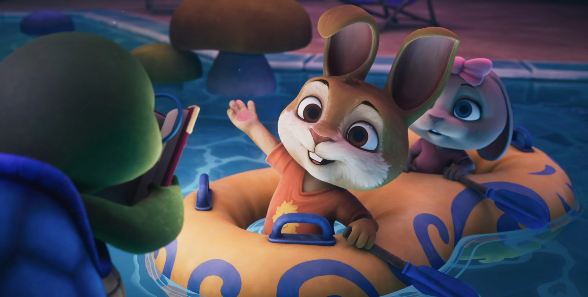
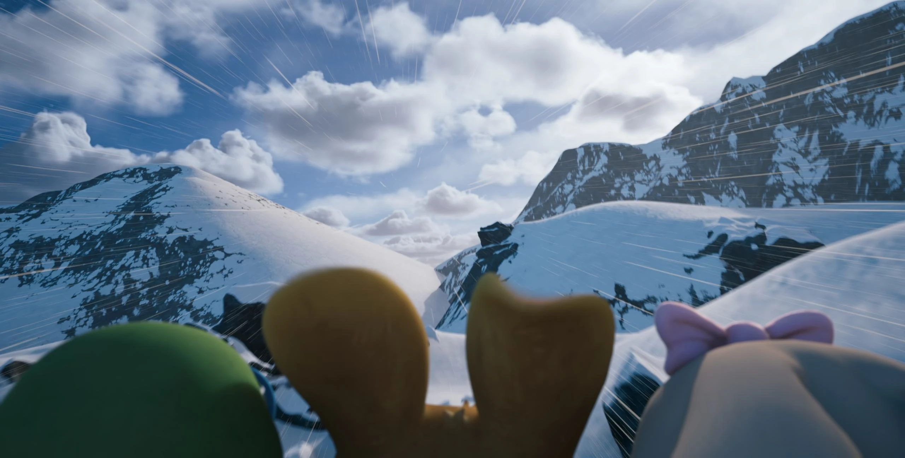
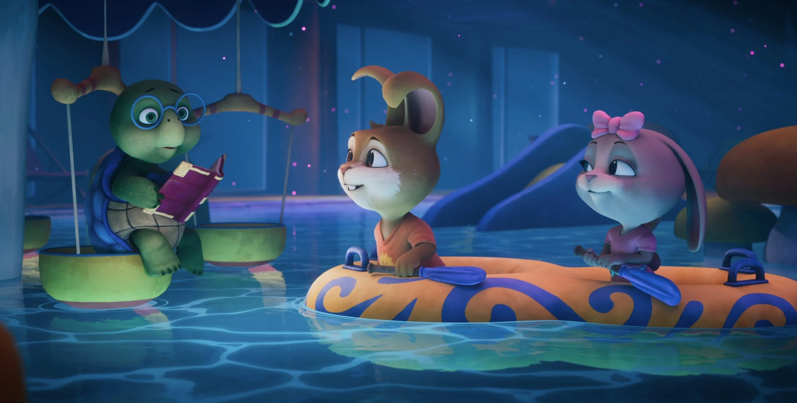
