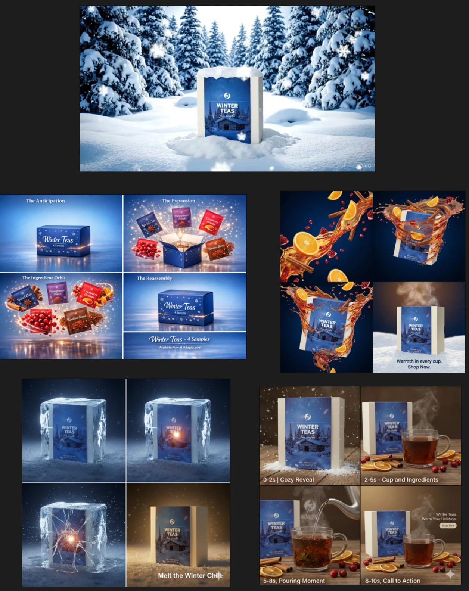

**Project Overview:** The client commissioned a promotional 3D animation to launch their new winter tea product line. I managed the pre-visualization phase by presenting multiple concepts, descriptive outlines, and cost estimates. To accelerate the creative pipeline, I utilized AI tools to generate storyboards for each concept, facilitating rapid client alignment.

**Technical Execution:** I developed a procedural animation system in Houdini to simulate the ingredients falling into the cup, combined with a high-fidelity FLIP fluid simulation for the water. The rendering was optimized for a clean, commercial look, and the final output was delivered after several rounds of precise client feedback.

### Project Media

<video width="100%" autoplay loop muted controlslist="nodownload"> <source src="/assets/projects/adtea/adtea_1500p.mp4"> </video>

