**Project Overview:** A signature 3D CGI ride film developed for the Cinesplash theater attraction at Yas Waterworld in Abu Dhabi, delivered in both stereoscopic 3D and standard 2D formats.

**Technical Execution:**
* **Pipeline Setup:** Established the global shading, lighting, and compositing pipeline.
* **Asset Lookdev:** Created custom PBR materials for key character and environment assets.
* **Shot Delivery:** Lit, rendered, and composited approximately 120 production shots in Nuke.
* **Rendering Optimization:** Implemented custom Arnold sampling strategies to meet strict render budgets.

### Compositing Breakdowns

### Lost Pearl Visuals

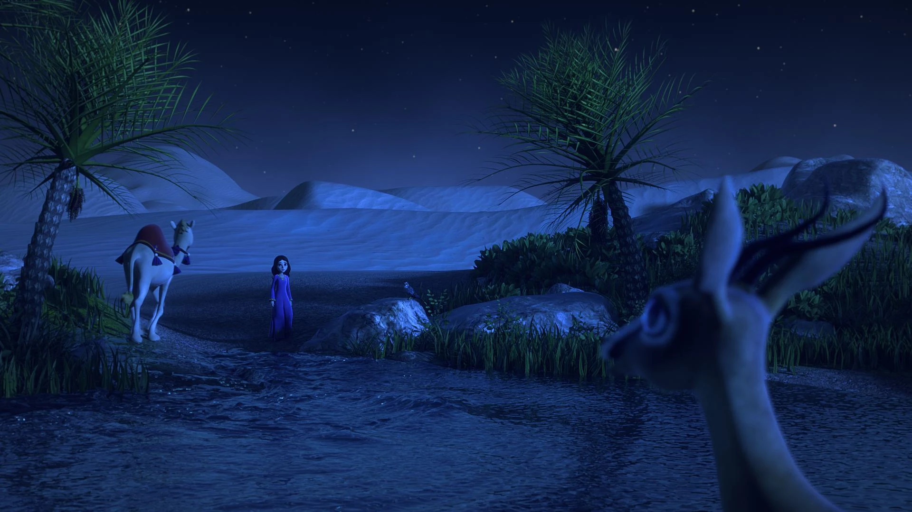
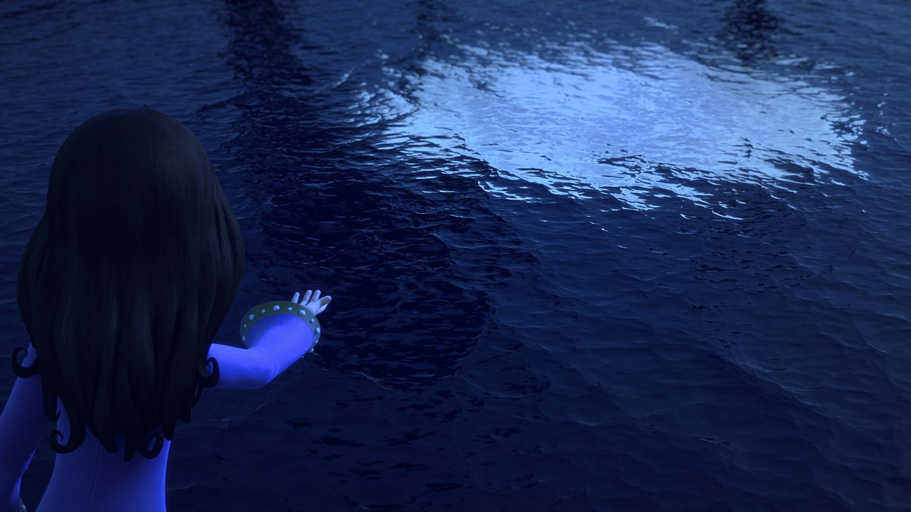
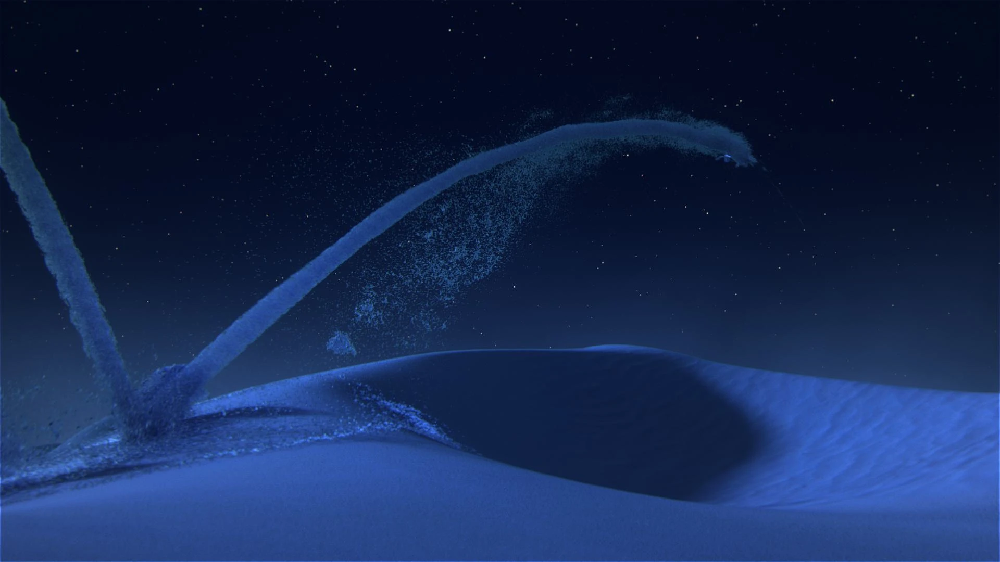
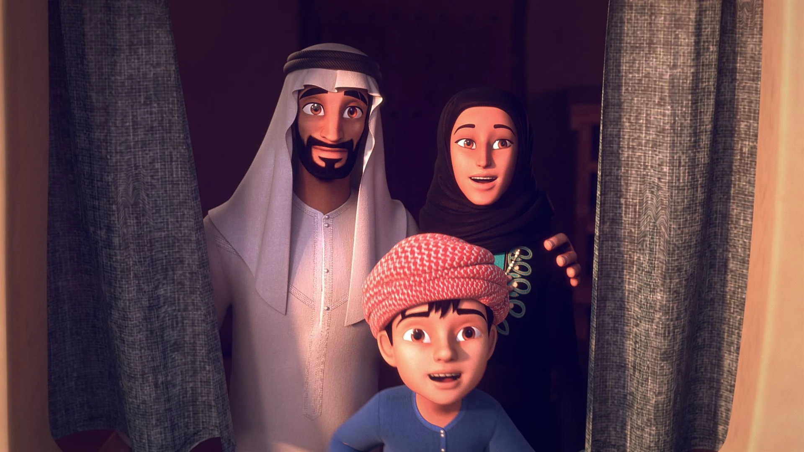
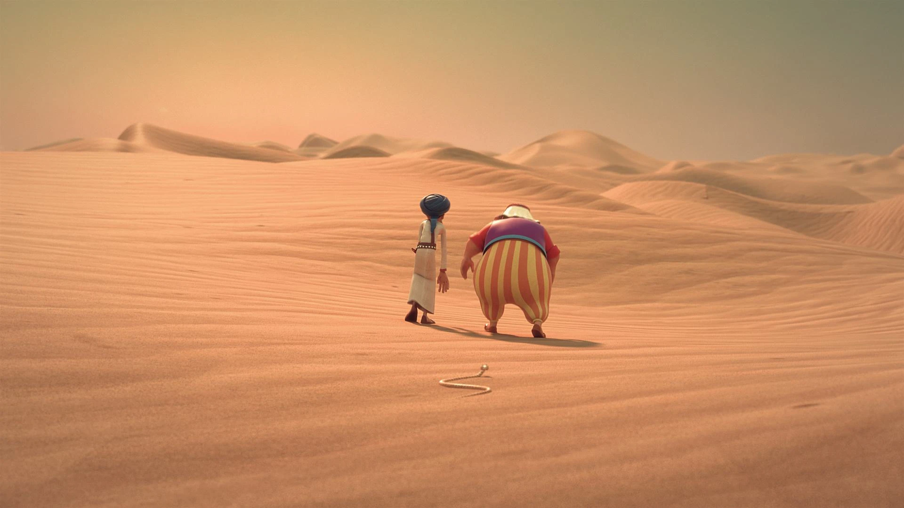
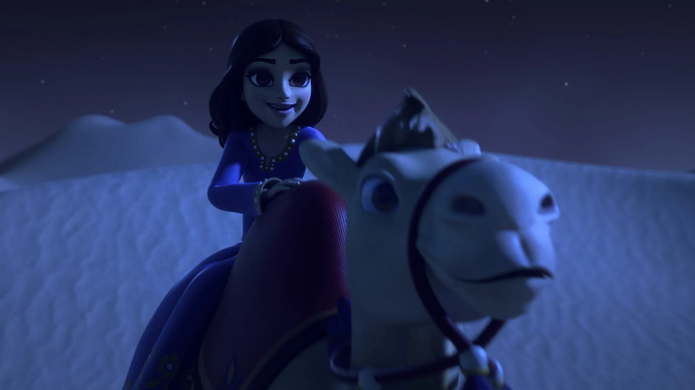
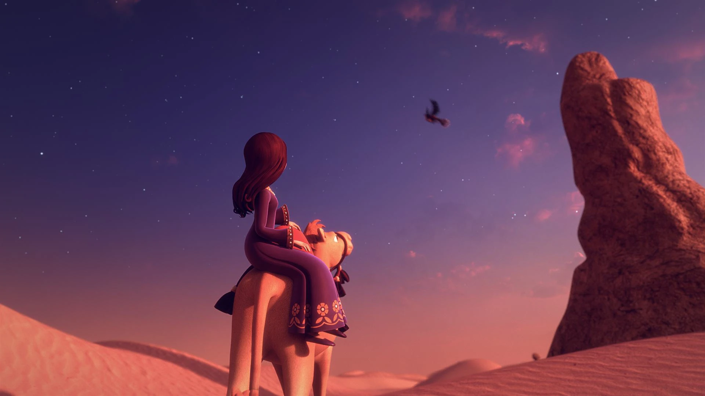
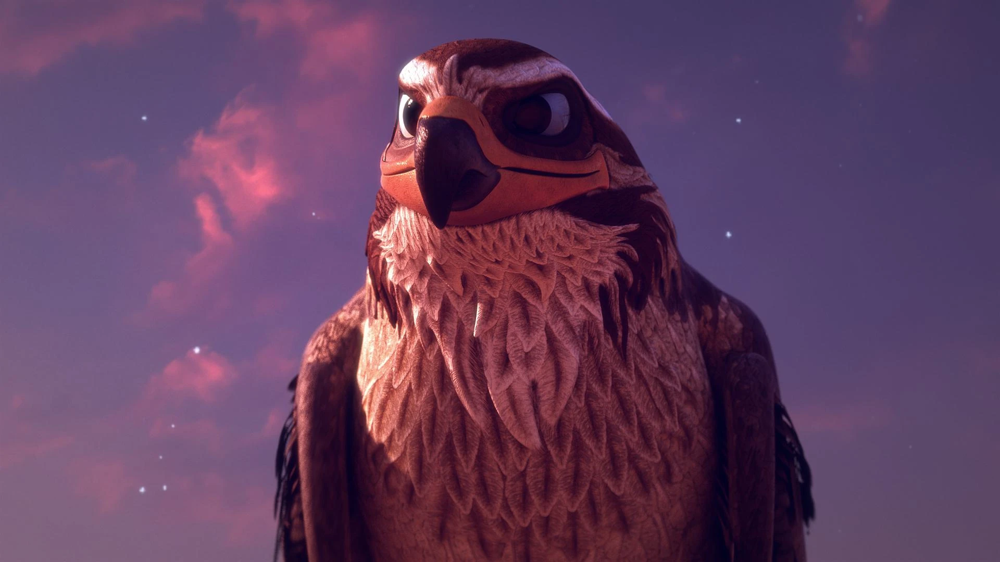
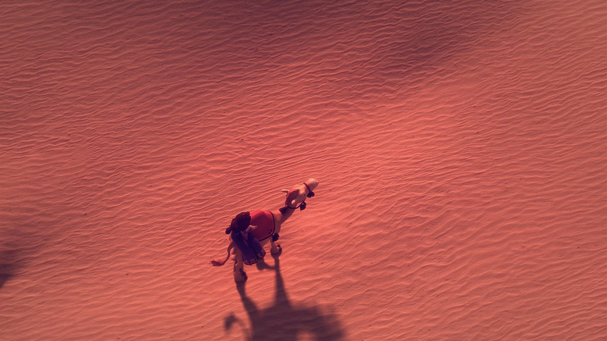
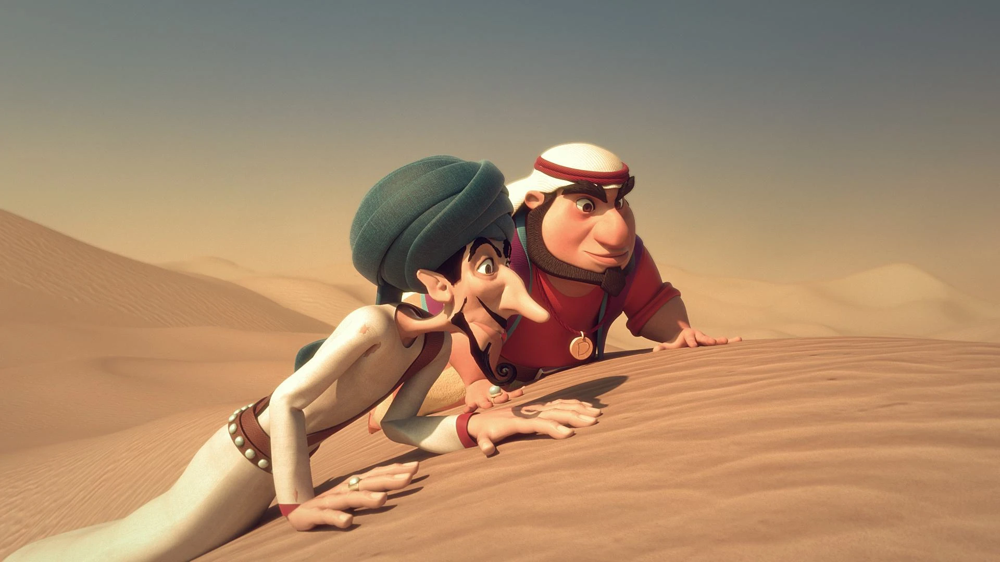
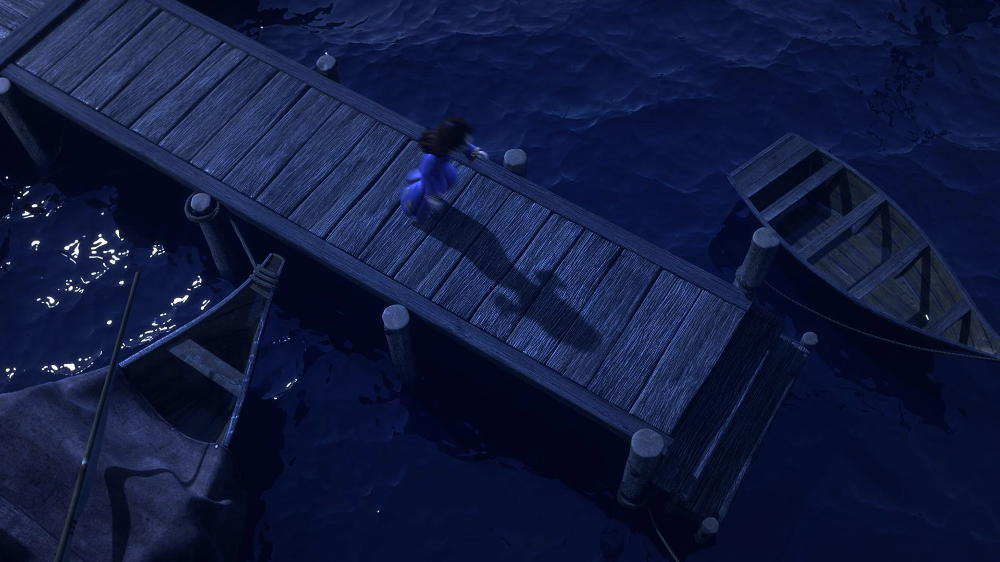
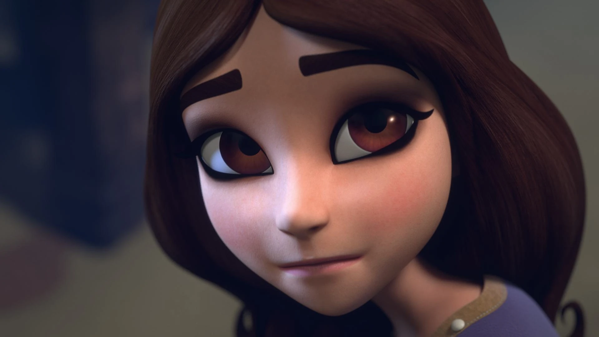
