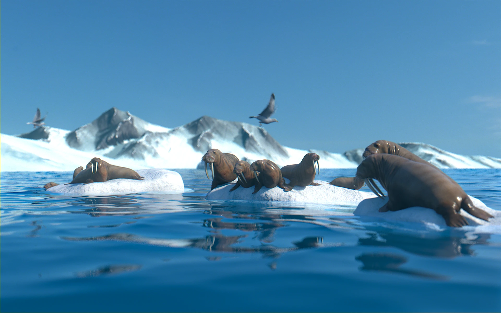
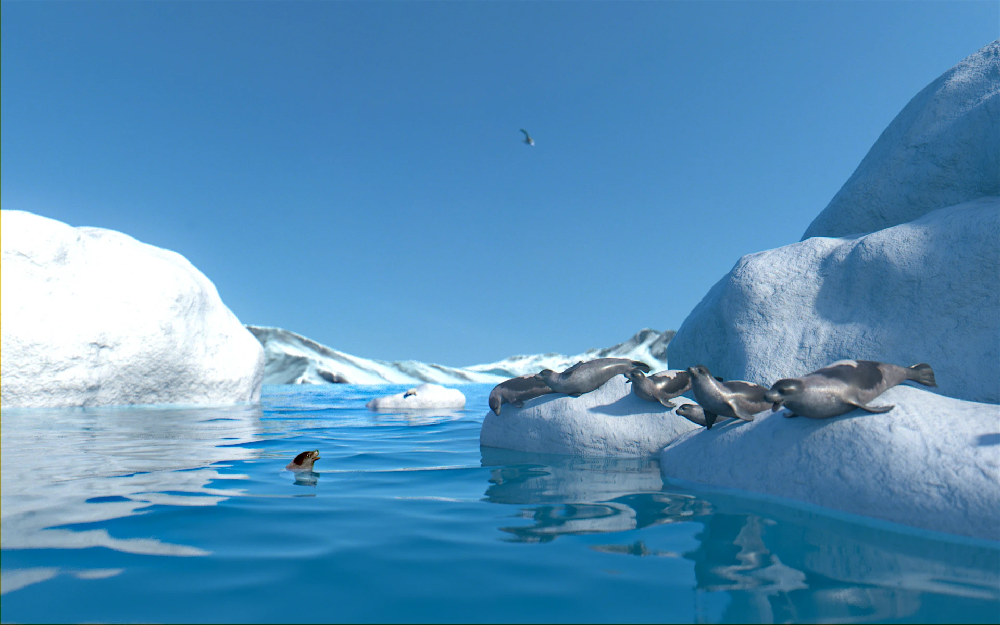
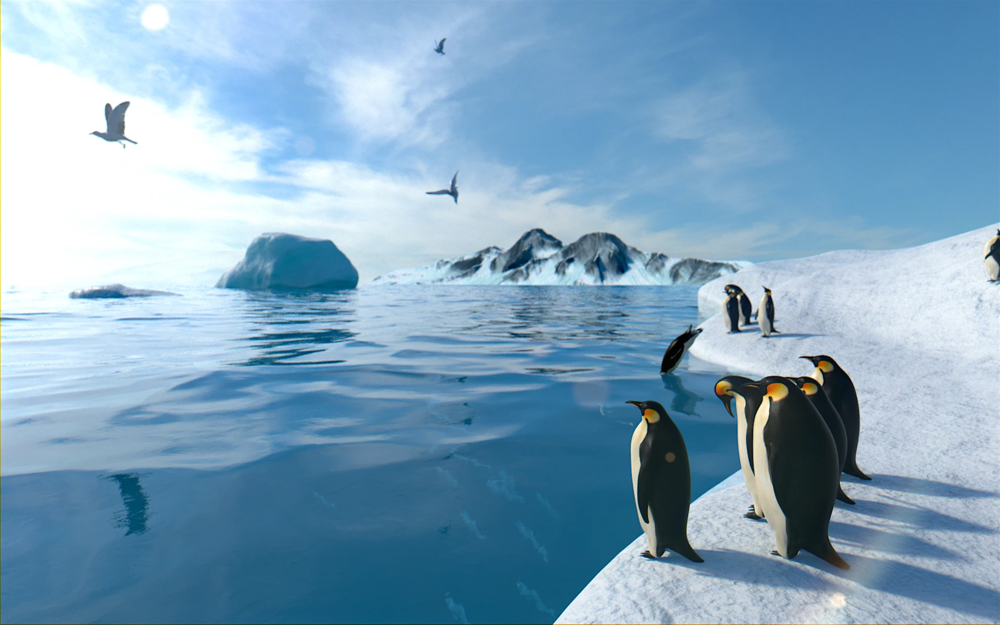
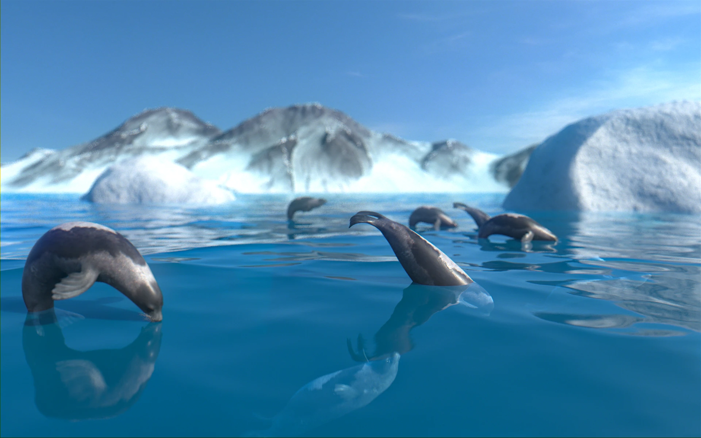
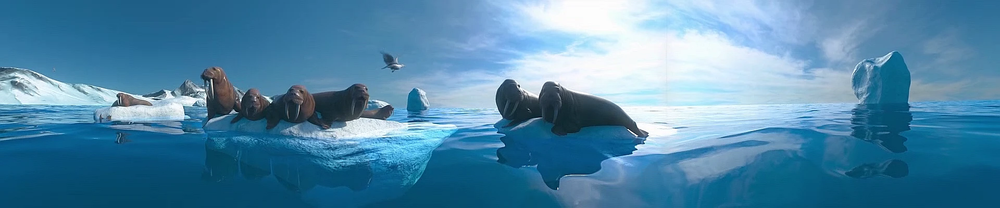
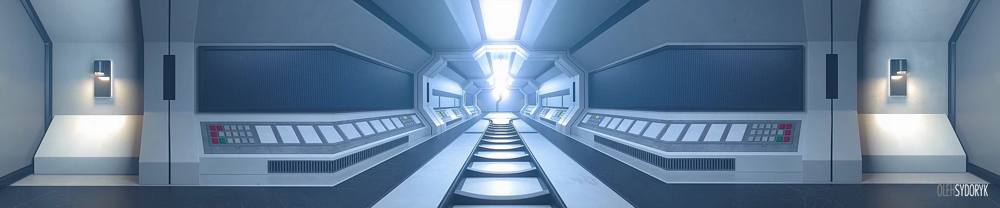
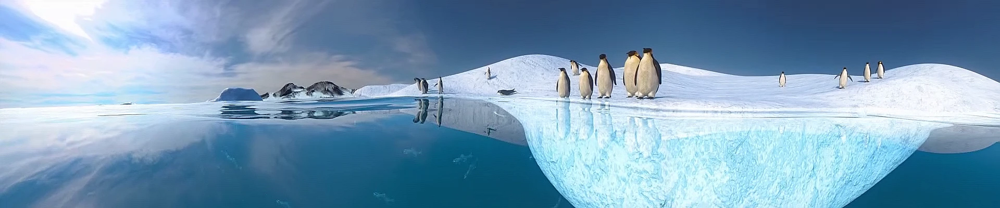
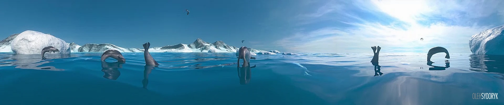

**Project Overview:** A cinematic CGI simulator ride film depicting an adventurous submarine expedition through the Arctic ocean. The visual experience was tailored for several viewing formats: standard 2D, stereoscopic 3D, and the 270-degree triple-projection Explorer 5D dome/theater system.

**Technical Execution:** I spearheaded the look development, camera projection setup, custom shading, environmental lighting, and final compositing in Nuke for the entire production. I also formulated optimization strategies to balance render fidelity with compute budget constraints in Arnold.

### Polar Dream Visuals

